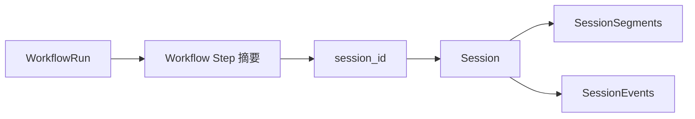
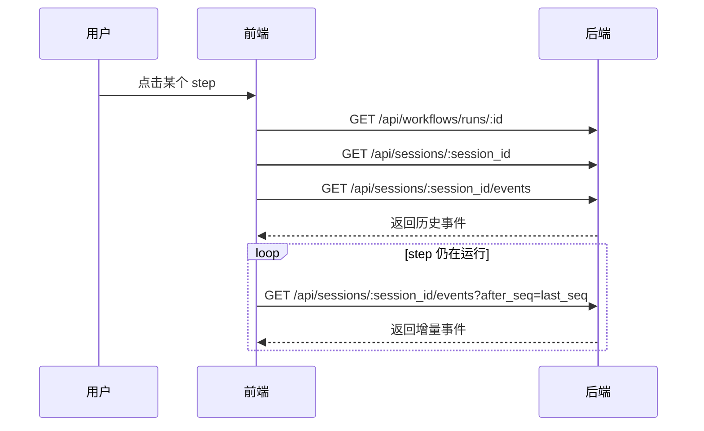
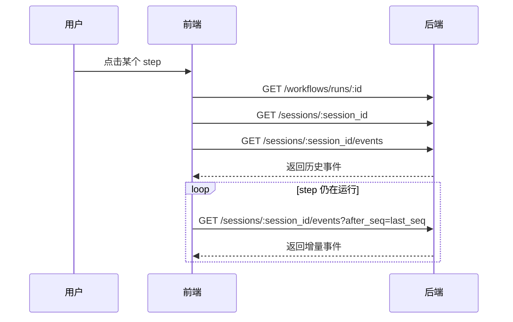

# Workflow Step Session 设计文档

## 1. 背景与目标

当前 workflow 在执行 step 时，本质上是一次性任务：

- step 运行过程中缺少可持续查看的会话载体
- 前端只能看到 step 状态，无法稳定查看 step 内部的大模型实时输出
- `step.output` 更像最终结果快照，不适合作为完整过程记录

本次设计的目标是：

1. workflow 运行后，每个 step 都拥有一个独立 session
2. 点击某个 step 时，右侧可以看到该 step 的完整历史输出
3. step 仍在运行时，前端可以持续看到新增输出
4. 第一版**不使用 WebSocket**，通过持久化 + 轮询增量实现实时展示
5. 保留 `session` 这个核心概念，但要保证 **session 字段职责纯粹**

---

## 2. 核心设计原则

### 2.1 保留 session，但 session 只表达“会话本体”

`session` 不是问题，问题在于不能把太多不同层次的职责塞进 session。

另外，`session.id` 必须是**系统内部的逻辑会话 id**，而不是底层 agent/provider 返回的 session id。

原因是：

- 不是所有 executor 都稳定提供 provider session id
- 一个逻辑 session 未来可能对应多次底层启动、恢复、重试
- 前端、workflow step、事件查询都应该围绕系统自己的主键工作

因此：

- `session.id` = 系统内部逻辑会话 id
- `provider_session_id` / `resume_token` / `checkpoint_ref` = 底层运行态引用，放到独立的 `session_segments` 中

session 应该只表达：

- 这是哪个 agent / executor 发起的会话
- 运行在哪个 worktree / branch
- 会话当前状态是什么
- 会话起始 prompt 是什么

session 不应该表达：

- workflow 当前编排到哪一步
- 前端如何订阅或轮询它
- UI 如何展示它
- 复杂的 workflow 归属与投影逻辑

### 2.2 历史过程以 event log 为准

不能再把完整历史仅仅存在一个 `output` 大字符串里。

权威数据源应为：

- `session_events`

`session` 中不再保留 `output` 字段。

完整历史、增量读取、结构化展示统一以 `session_events` 为唯一真相来源。

### 2.3 workflow step 只保留轻量关联

workflow step 本身是编排视图，不应该承载完整会话历史。

因此应采用：

- workflow step 持有 `session_id` 的轻量引用
- 会话明细放在 session + session_events

---

## 3. 领域模型

### 3.1 总览



含义：

- `WorkflowRun` 仍然是一次工作流运行
- `Workflow Step` 保留状态摘要，并关联到一个 `session_id`
- `Session` 代表某个 step 的逻辑会话
- `SessionSegments` 表示该逻辑会话下的一次次底层实际运行
- `SessionEvents` 承载完整过程记录

---

## 4. 数据模型设计

## 4.1 Session

建议把 session 设计为“会话本体”。

### 推荐字段

| 字段 | 说明 | 是否保留 |
| --- | --- | --- |
| `id` | session 唯一标识 | 保留 |
| `status` | `CREATED / RUNNING / COMPLETED / FAILED / STOPPED` | 保留 |
| `agent_id` | 运行该会话的 agent | 保留 |
| `executor_type` | 执行器类型，如 `CLAUDE_CODE` | 保留 |
| `worktree_path` | 运行目录 | 保留 |
| `branch` | 当前分支 | 保留 |
| `initial_prompt` | 会话起始 prompt | 保留 |
| `started_at` | 开始时间 | 保留 |
| `completed_at` | 结束时间 | 保留 |
| `created_at` | 创建时间 | 保留 |
| `updated_at` | 更新时间 | 保留 |

### 不建议直接塞进 Session 的字段

| 字段 | 原因 |
| --- | --- |
| `current_step` | 属于 workflow 编排视图，不属于 session 本体 |
| `workflow summary` | 属于 run/step 摘要层 |
| `poll_after_seq` / `channel` | 属于传输层/读取层，不属于领域模型 |
| `output` | 完整历史应来自 `session_events`，不应在 session 本体重复存储 |
| 大量 UI 专用字段 | 属于前端投影层 |

### 关于 `workflow_run_id` / `workflow_step_id`

这两个字段不是完全不能有，但要谨慎。

推荐策略：

- 如果为了查询方便，允许在 session 上保留最小归属字段
- 但不要让 session 变成“workflow 编排总表”
- 如果后续字段持续膨胀，应该拆出独立关联层，而不是继续向 session 堆字段

---

## 4.2 SessionSegments

`session_segments` 表示：

> 同一个逻辑 session 下，一次底层实际运行片段。

例如以下场景都会形成新的 segment：

- 首次启动
- stop 后 continue
- 基于 provider 能力 resume
- 异常后 retry

### 设计目的

将“逻辑会话”与“底层一次实际运行”分离：

- `session` 负责稳定的业务主键与完整历史归属
- `session_segment` 负责记录某次底层运行实例
- `session_events` 负责记录完整事件历史

这样可以保证：

- 前端始终只认一个 `session.id`
- 后端可以灵活选择原生恢复、重建恢复或重新拉起
- provider 状态不会污染 session 本体

### 推荐字段

| 字段 | 说明 |
| --- | --- |
| `id` | segment 唯一标识 |
| `session_id` | 所属逻辑 session |
| `segment_index` | 第几个 segment，从 1 开始递增 |
| `status` | `CREATED / RUNNING / COMPLETED / FAILED / STOPPED` |
| `executor_type` | 本次运行所用 executor |
| `agent_id` | 本次运行所用 agent |
| `provider_session_id` | 底层 agent/provider 的会话 id |
| `resume_token` | provider 恢复用 token，可选 |
| `checkpoint_ref` | checkpoint 引用，可选 |
| `trigger_type` | `START / CONTINUE / RESUME / RETRY` |
| `parent_segment_id` | 从哪个 segment 派生而来，可选 |
| `started_at` | 本次运行开始时间 |
| `completed_at` | 本次运行结束时间 |
| `metadata` | provider 扩展信息 |

### 说明

`session_segment` 不负责存储：

- 完整消息历史
- workflow 编排摘要
- 前端轮询状态
- 大块 output 文本

这些职责分别属于：

- `session_events`
- `workflow_runs.steps[]`
- 应用读取层

### 与恢复能力的关系

如果未来要支持对话恢复：

- 优先按 `session.id` 找到逻辑会话
- 再查最后一个 `session_segment`
- 如果底层支持原生恢复，则使用该 segment 上的 `provider_session_id` / `resume_token`
- 如果底层不支持原生恢复，则基于 `session_events` 重建上下文，再启动一个新的 segment

也就是说：

- 用户看到的是同一个 `session`
- 后端底层可以对应多个 `session_segment`

---

## 4.3 SessionEvents

session 的完整历史统一进入 `session_events`。

### 推荐字段

| 字段 | 说明 |
| --- | --- |
| `id` | 事件唯一标识 |
| `session_id` | 所属 session |
| `segment_id` | 来源于哪个 session segment |
| `seq` | 自增序号，用于增量轮询；同一 session 下严格单调递增 |
| `kind` | 统一事件类型 |
| `role` | 角色 |
| `content` | 主文本内容 |
| `payload` | 扩展结构化数据 |
| `created_at` | 事件时间 |

### `kind` 建议值

统一事件类型收敛为：

- `message`
- `tool_call`
- `tool_result`
- `status`
- `error`
- `artifact`
- `stream_chunk`

说明：

- 不再把 `stdout` / `stderr` 作为顶层业务事件类型
- 如果确实需要保留底层来源信息，统一放在 `payload.stream = 'stdout' | 'stderr'`
- 这样不同 executor 只是适配层不同，不会把底层语义泄漏到领域模型

### `role` 建议值

- `assistant`
- `system`
- `tool`
- `user`（第一版可以先不用，但建议预留）

### payload 最小约束建议

为避免“kind 虽然统一，但 payload 结构发散”，建议至少定义以下最小约束：

- `message`: `{}` 或扩展元信息
- `tool_call`: `{ tool_name, arguments }`
- `tool_result`: `{ tool_name, result }`
- `status`: `{ from, to }`
- `error`: `{ code?, details? }`
- `artifact`: `{ artifact_type, ref }`
- `stream_chunk`: `{ stream: 'stdout' | 'stderr' }`

第一版允许不同 executor 填充不同扩展字段，但必须满足各自 kind 的最小约束。

### 历史与快照的一致性规则

`session_events` 是历史真相来源；`session.status` 与 `session_segment.status` 是当前状态快照。

因此状态变化时必须遵循同一规则：

1. 追加一条 `kind = status` 的事件
2. 同步更新 `session.status`
3. 同步更新当前 `session_segment.status`

这样可以避免历史与快照漂移。

### seq 规则

- `seq` 以 `session` 为维度递增，而不是以 `segment` 为维度递增
- 同一个逻辑 session 下，无论经历多少次 segment，事件序号都保持严格单调递增
- `after_seq` 采用排他语义，即返回 `seq > after_seq` 的事件
- 返回结果按 `seq ASC` 排序
- `last_seq` 表示本次返回结果中的最大 `seq`
- 前端基于 `last_seq` 继续轮询

这样可以保证前端始终按一个逻辑 session 连续消费历史，而不需要理解 segment 切换细节。

### step 与 session 的稳定性约束

在同一个 `workflow_run` 内，同一个 step 必须绑定到同一个逻辑 `session_id`。

也就是说：

- `continue`
- `resume`
- `retry`

都只会创建新的 `session_segment`，不会创建新的逻辑 session。

只有以下情况才应创建新的 `session`：

- 新的 workflow run
- 该 step 被明确视为新的独立执行实例
- 业务上主动重建会话，而不是继续原会话

这是保证“右侧面板看到的是一条连续会话历史”的关键约束。

### 事件与 segment 的关系

为了支持恢复、重试、审计，每条 `session_event` 都应明确归属于某个 `segment_id`。

这样可以区分：

- 哪些事件来自首次启动
- 哪些事件来自 resume 之后的新一段运行
- 哪些事件来自 retry

前端仍然可以按 `session_id` 聚合展示；而后端在调试、恢复、审计时可以精确定位到底层运行片段。

因此这里不建议把 `segment_id` 仅作为可选字段，而应视为标准字段。

---

## 4.4 Workflow Step 与 Session 的关系

第一版建议采用**最小关联方案**。

### 方案

在 `workflow_runs.steps[]` 中增加轻量字段：

- `session_id`
- `summary`（可选）
- `error`（已有可复用）

### 目的

让 workflow 只承担“编排摘要”职责：

- 当前 step 状态
- 是否完成/失败
- 这个 step 对应哪个 session

而不是让 workflow step 自己存完整对话历史。

### 结构示意

```mermaid
flowchart TD
    A[workflow_runs.steps[]] -->|轻量引用| B[session_id]
    B --> C[sessions]
    C --> D[session_segments]
    C --> E[session_events]
```

---

## 5. 执行流程设计

## 5.1 Step 启动时

当 workflow 开始执行某个 step 时：

1. 如果该 step 在当前 workflow run 下还没有逻辑 session，则创建 session
2. 创建该 session 的第一个 `session_segment`
3. 把 `session_id` 写入当前 step 摘要
4. 将 session 状态置为 `RUNNING`
5. 将当前 segment 状态置为 `RUNNING`
6. executor 在执行过程中持续写入 `session_events`

注意：

- 同一个 workflow run 下，同一个 step 后续的 continue / resume / retry 不会新建 session
- 它们只会创建新的 `session_segment`

## 5.2 Step 执行过程中

executor 不直接只产出最终结果，而是持续产出统一事件：

- `message`
- `tool_call`
- `tool_result`
- `status`
- `error`
- `artifact`
- `stream_chunk`

这些事件统一写入 `session_events`，并且每条事件都要带上所属的 `segment_id`。

## 5.3 Step 完成时

1. 追加一条最终状态事件
2. 更新 session 状态为 `COMPLETED` / `FAILED`
3. 更新当前 segment 状态为 `COMPLETED` / `FAILED`
4. 更新 workflow step 摘要状态
5. 如有需要，仅回写 step 摘要信息，不再向 session 写入 `output` 快照

## 5.4 Continue / Resume / Retry 时

1. 根据 `session_id` 找到逻辑 session
2. 读取最后一个 `session_segment`
3. 如果底层 provider 支持原生恢复，则使用该 segment 上的 `provider_session_id` / `resume_token`
4. 如果底层 provider 不支持原生恢复，则根据 `session_events` 重建上下文
5. 创建新的 `session_segment`
6. 后续新增事件继续写入同一个 `session_id` 下，但归属新的 `segment_id`

这样可以保证：

- 用户看到的是同一条连续对话
- 后端又能清晰区分每一次底层运行片段

---

## 6. 后端抽象建议

这次要抽象的不是“session transport framework”，而是：

**围绕 session 的执行过程记录框架**

### 建议拆分的服务

#### 6.1 SessionService
职责：

- 创建逻辑 session
- 更新 session 状态
- 根据 id 查询 session
- 提供 session 基本详情

#### 6.2 SessionSegmentService
职责：

- 为逻辑 session 创建新的 segment
- 记录本次底层运行状态
- 保存 provider session id / resume token / checkpoint 引用
- 为 continue / resume / retry 提供最新运行片段查询

#### 6.3 SessionEventService
职责：

- append event
- 按 `session_id + after_seq` 增量查询
- 维护事件顺序
- 保证事件带有 `segment_id`

#### 6.4 ExecutionEventSink
职责：

为 executor 提供统一写入口，例如：

- `appendMessage()`
- `appendToolCall()`
- `appendToolResult()`
- `appendStatus()`
- `appendError()`
- `appendArtifact()`
- `appendStreamChunk()`

这样 executor 不直接操作 repository，而是统一通过 sink 写事件。

#### 6.5 WorkflowService
职责保持聚焦：

- 推进 workflow 编排
- 为 step 创建逻辑 session
- 为每次运行创建新的 session segment
- 把 `session_id` 写回 step 摘要
- 不负责承载完整事件历史

---

## 7. Executor 适配策略

不同 executor 统一向 `session_events` 写入事件。

### 统一建模原则
不同 executor 都必须映射到统一的 session event 模型，不能以“识别不了就回退成另一套临时语义”的方式处理。

第一版允许底层采集来源不同，但落库后的模型必须统一：

- `message`
- `tool_call`
- `tool_result`
- `status`
- `error`
- `artifact`
- `stream_chunk`

### Claude Code
Claude Code 适配器负责把执行过程映射到统一事件模型中。即使底层暂时只能拿到文本流，也应转换成统一定义的事件类型，而不是在领域层保留特殊回退分支。

### 其他 executor（Codex / OpenCode）
其他 executor 同样遵循同一套事件模型，只是在早期实现中，可能主要产出：

- `message`
- `status`
- `error`
- `stream_chunk`

这样前端只需要面向一套事件模型渲染，不依赖某个 executor 的特殊处理逻辑。

---

## 8. API 设计

第一版不用 WebSocket，改用历史读取 + 增量轮询。

## 8.1 获取 workflow run

`GET /api/workflows/runs/:id`

返回时每个 step 应包含：

- `step_id`
- `name`
- `status`
- `session_id`
- `summary`
- `error`

## 8.2 获取 session 详情

`GET /api/sessions/:id`

返回：

- session 基本信息
- 当前状态
- agent / executor / worktree / branch

## 8.3 获取 session events

`GET /api/sessions/:id/events?after_seq=120&limit=200`

返回：

- `events`
- `last_seq`
- `has_more`（可选）

### 说明

前端第一次打开 step 时：

- 先拉 session 详情
- 再拉一次事件历史

如果 session 仍在运行：

- 每 1~2 秒带 `after_seq` 轮询一次
- 将新增事件追加到右侧面板

---

## 9. 前端设计

## 9.1 交互目标

用户打开 workflow 后：

- 左侧看到 step 列表
- 点击某个 step
- 右侧展示该 step 对应 session 的结构化会话流
- 已完成 step 看历史
- 运行中 step 看历史 + 持续增量追加

## 9.2 组件建议

### 左侧
- `WorkflowStepList`

职责：
- 展示 step 状态
- 允许切换 step
- 当前选中 step 高亮

### 右侧
- `StepSessionPanel`

职责：
- 根据 `session_id` 拉取 session 详情
- 拉取 session events
- 如果 session 仍在运行，则轮询增量事件
- 渲染为对话形式

### 事件渲染器
- `SessionEventRenderer`

职责：
- `message` -> chat bubble
- `tool_call` / `tool_result` -> tool 卡片
- `status` -> 系统消息
- `error` -> 错误消息
- `artifact` -> 制品卡片
- `stream_chunk` -> 通用流式文本块（可根据 `payload.stream` 再决定样式）

---

## 10. 前端数据流



---

## 11. 为什么这版比“把所有字段塞进 session”更合适

### 优点

1. **保留 session 这个自然概念**
   - 与未来 continue / resume 方向一致

2. **session 字段更纯粹**
   - 只表达会话本体与基础运行上下文

3. **完整历史唯一真相清晰**
   - 事件明细统一放在 `session_events`

4. **provider 运行态有清晰边界**
   - `provider_session_id` / `resume_token` 等只放在 `session_segments`

5. **workflow 仍然轻量**
   - 只做编排摘要与 session 关联

6. **前端演进空间充足**
   - 后续即使改为 websocket，也只是读取方式变化，不需要推翻领域模型

### 风险

1. session 与 workflow step 的关联设计如果过重，仍会再次污染 session
2. 如果事件类型或 payload 约束不明确，仍会出现“表面统一，实际发散”的问题
3. 如果 segment 与 event 不建立稳定关联，恢复与审计会变得困难

---

## 12. 推荐落地顺序

### Phase 1：打通基础链路

- step 启动时创建逻辑 session
- 同时创建第一个 session segment
- workflow step 摘要写入 `session_id`
- executor 执行过程中持续写入 `session_events`
- 前端点击 step 后读取历史并轮询增量

### Phase 2：优化统一事件展示

- 提升 Claude 输出到统一事件模型的映射质量
- 增加 `message / tool_call / tool_result / artifact` 渲染效果
- 保留 `stream_chunk` 作为统一的底层流事件承接类型

### Phase 3：为继续对话铺路

- 在当前 session 模型上追加输入能力
- 基于 `session_segments` 支持 continue / resume / retry
- 不需要推翻本次设计

---

## 13. 最终结论

本次设计建议采用：

- **workflow step = 独立逻辑 session**
- **session 只承载会话本体与基础运行上下文**
- **底层 provider 运行态 = session_segments**
- **完整历史 = session_events**
- **workflow step 只保留 `session_id` 等轻量关联信息**
- **第一版通过 API 轮询增量实现实时展示，不使用 WebSocket**

一句话概括：

> 不是去掉 session，而是把 session 从“万能执行容器”收敛回“纯粹会话实体”；再用 session_segments 承载底层运行态，用 session_events 承载完整过程，用 workflow step 承载编排摘要。

---

## 4.4 Workflow Step 与 Session 的关系

第一版建议采用**最小关联方案**。

### 方案

在 `workflow_runs.steps[]` 中增加轻量字段：

- `session_id`
- `summary`（可选）
- `error`（已有可复用）

### 目的

让 workflow 只承担“编排摘要”职责：

- 当前 step 状态
- 是否完成/失败
- 这个 step 对应哪个 session

而不是让 workflow step 自己存完整对话历史。

### 结构示意

```mermaid
flowchart TD
    A[workflow_runs.steps[]] -->|轻量引用| B[session_id]
    B --> C[sessions]
    C --> D[session_events]
```

---

## 5. 执行流程设计

## 5.1 Step 启动时

当 workflow 开始执行某个 step 时：

1. 创建该 step 对应的 session
2. 把 `session_id` 写入当前 step 摘要
3. 将 session 状态置为 `RUNNING`
4. executor 在执行过程中持续写入 `session_events`

## 5.2 Step 执行过程中

executor 不直接只产出最终结果，而是持续产出事件：

- assistant message
- tool call
- tool result
- stdout
- stderr
- status

这些事件统一写入 `session_events`。

## 5.3 Step 完成时

1. 更新 session 状态为 `COMPLETED` / `FAILED`
2. 更新 workflow step 摘要状态
3. 如有需要，仅回写 step 摘要信息，不再向 session 写入 `output` 快照

---

## 6. 后端抽象建议

这次要抽象的不是“session transport framework”，而是：

**围绕 session 的执行过程记录框架**

### 建议拆分的服务

#### 6.1 SessionService
职责：

- 创建 session
- 更新 session 状态
- 根据 id 查询 session
- 提供 session 基本详情

#### 6.2 SessionSegmentService
职责：

- 为逻辑 session 创建新的 segment
- 记录本次底层运行状态
- 保存 provider session id / resume token / checkpoint 引用
- 为 continue / resume / retry 提供最新运行片段查询

#### 6.3 SessionEventService
职责：

- append event
- 按 `session_id + after_seq` 增量查询
- 维护事件顺序
- 可选记录 `segment_id`，用于标识事件来自哪次底层运行片段

#### 6.4 ExecutionEventSink
职责：

为 executor 提供统一写入口，例如：

- `appendMessage()`
- `appendToolCall()`
- `appendToolResult()`
- `appendStdout()`
- `appendStderr()`
- `appendStatus()`
- `appendError()`

这样 executor 不直接操作 repository，而是统一通过 sink 写事件。

#### 6.5 WorkflowService
职责保持聚焦：

- 推进 workflow 编排
- 为 step 创建 session
- 把 `session_id` 写回 step 摘要
- 不负责承载完整事件历史

---

## 7. Executor 适配策略

不同 executor 统一向 `session_events` 写入事件。

### 统一建模原则
不同 executor 都必须映射到统一的 session event 模型，不能以“识别不了就回退成另一套临时语义”的方式处理。

第一版允许底层采集来源不同，但落库后的模型必须统一：

- `message`
- `tool_call`
- `tool_result`
- `status`
- `error`
- `artifact`
- `stream_chunk`（如确实需要承接底层流式文本，可统一抽象为一种标准事件，而不是特殊回退分支）

### Claude Code
Claude Code 适配器负责把执行过程映射到统一事件模型中。即使底层暂时只能拿到文本流，也应转换成统一定义的事件类型，而不是在领域层保留“识别失败回退 stdout/stderr”这种分叉语义。

### 其他 executor（Codex / OpenCode）
其他 executor 同样遵循同一套事件模型，只是在早期实现中，可能主要产出：

- `message`
- `status`
- `error`
- `stream_chunk`

这样前端只需要面向一套事件模型渲染，不依赖某个 executor 的特殊回退逻辑。

### 建议
为了保证模型统一性，建议不要把 `stdout` / `stderr` 作为面向上层业务语义的最终事件类型，而是把它们视为底层采集来源。真正落库的 `session_events.kind` 应收敛为统一语义事件集合。

如果确实需要保留底层来源信息，可以放在 `payload.stream = 'stdout' | 'stderr'` 中，而不是让顶层事件类型分叉。

这样可以保证：

- 领域模型统一
- 前端渲染逻辑统一
- 不同 executor 只是适配层不同，不会污染上层设计

---

## 8. API 设计

第一版不用 WebSocket，改用历史读取 + 增量轮询。

## 8.1 获取 workflow run

`GET /api/workflows/runs/:id`

返回时每个 step 应包含：

- `step_id`
- `name`
- `status`
- `session_id`
- `summary`
- `error`

## 8.2 获取 session 详情

`GET /api/sessions/:id`

返回：

- session 基本信息
- 当前状态
- agent / executor / worktree / branch

## 8.3 获取 session events

`GET /api/sessions/:id/events?after_seq=120&limit=200`

返回：

- `events`
- `last_seq`
- `has_more`（可选）

### 说明

前端第一次打开 step 时：

- 先拉 session 详情
- 再拉一次事件历史

如果 session 仍在运行：

- 每 1~2 秒带 `after_seq` 轮询一次
- 将新增事件追加到右侧面板

---

## 9. 前端设计

## 9.1 交互目标

用户打开 workflow 后：

- 左侧看到 step 列表
- 点击某个 step
- 右侧展示该 step 对应 session 的结构化会话流
- 已完成 step 看历史
- 运行中 step 看历史 + 持续增量追加

## 9.2 组件建议

### 左侧
- `WorkflowStepList`

职责：
- 展示 step 状态
- 允许切换 step
- 当前选中 step 高亮

### 右侧
- `StepSessionPanel`

职责：
- 根据 `session_id` 拉取 session 详情
- 拉取 session events
- 如果 session 仍在运行，则轮询增量事件
- 渲染为对话形式

### 事件渲染器
- `SessionEventRenderer`

职责：
- `message` -> chat bubble
- `tool_call` / `tool_result` -> tool 卡片
- `status` -> 系统消息
- `stdout` / `stderr` -> 回退输出块

---

## 10. 前端数据流



---

## 11. 为什么这版比“把所有字段塞进 session”更合适

### 优点

1. **保留 session 这个自然概念**
   - 与未来 continue / resume 方向一致

2. **session 字段更纯粹**
   - 只表达会话本体与基础运行上下文

3. **历史记录职责清晰**
   - 事件明细统一放在 `session_events`

4. **workflow 仍然轻量**
   - 只做编排摘要与 session 关联

5. **前端演进空间充足**
   - 后续即使改为 websocket，也只是读取方式变化，不需要推翻领域模型

### 风险

1. session 与 workflow step 的关联设计如果过重，仍会再次污染 session
2. 如果 `session.output` 长期与 `session_events` 并存，容易出现双真相
3. 如果 Claude 输出解析不稳定，第一版可能需要较多 `stdout/stderr` 回退展示

---

## 12. 推荐落地顺序

### Phase 1：打通基础链路

- step 启动时创建 session
- workflow step 摘要写入 `session_id`
- executor 执行过程中持续写入 `session_events`
- 前端点击 step 后读取历史并轮询增量

### Phase 2：优化结构化展示

- 提升 Claude 输出解析质量
- 增加 `message / tool_call / tool_result` 渲染效果
- 保留 `stdout/stderr` 兜底

### Phase 3：为继续对话铺路

- 在当前 session 模型上追加输入能力
- 支持 continue / resume
- 不需要推翻本次设计

---

## 13. 最终结论

本次设计建议采用：

- **workflow step = 独立 session**
- **session 只承载会话本体与基础运行上下文**
- **完整历史 = session_events**
- **workflow step 只保留 `session_id` 等轻量关联信息**
- **第一版通过 API 轮询增量实现实时展示，不使用 WebSocket**

一句话概括：

> 不是去掉 session，而是把 session 从“万能执行容器”收敛回“纯粹会话实体”，再用 session_events 承载过程，用 workflow step 承载编排摘要。
