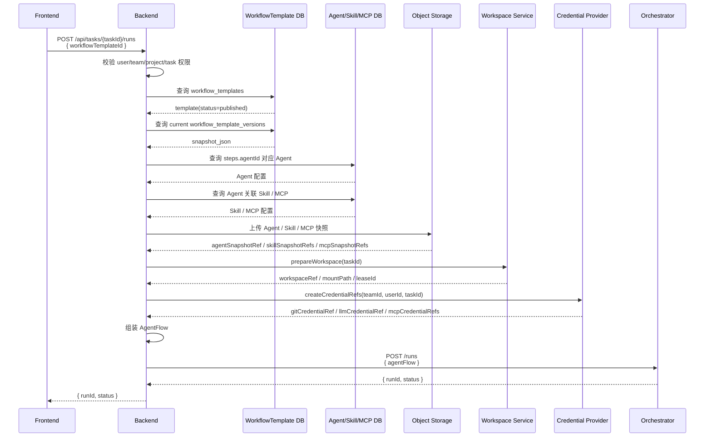

# Orchestrator AgentFlow 与 Workflow 模板设计（草案）

> 文档定位：在 Coplat 云端化总体架构下，细化 Orchestrator 与 Backend、Workflow 模板、AgentFlow、Agent Core 之间的职责边界和数据模型。本文重点覆盖微服务边界、模板存储、AgentFlow 快照、模板到 AgentFlow 的转换，以及当前已确认的 MVP 约束；调度器状态机、运行库表结构后续另文展开。

## 0. 概要

本文定义 Coplat 云端化后 Orchestrator 层与 Backend、Agent Core、Workflow 模板、AgentFlow 之间的职责边界和 MVP 数据模型。

整体架构上，Backend 是业务控制面，负责用户 / 团队权限、Workflow 模板、Agent / Skill / MCP 配置、workspace、credential refs 和 AgentFlow 组装；Orchestrator 是工作流编排层，只执行 Backend 提交的 AgentFlow，不读取 Backend 业务表，不感知底层运行时；Agent Core 是运行时执行层，负责把 Orchestrator 的 StepAttempt 落到实际执行环境，并回报 Agent 执行事件。

AgentFlow 是 Backend 在启动 run 时生成的不可变执行快照，由已发布 WorkflowTemplateVersion、Agent / Skill / MCP 快照引用、task / project / workspace 上下文、credential refs 和 prompt variables 组成。Orchestrator 持久化并执行 AgentFlow，不受后续模板或 Agent 配置变更影响。

Workflow 模板属于 Backend 数据库，主要包含 `workflow_templates`、`workflow_template_steps`、`workflow_template_edges`、`workflow_template_versions` 四类表。运行时 Backend 从已发布模板版本生成 AgentFlow，再调用 Orchestrator `POST /runs` 启动执行。

Orchestrator 的执行语义包括：简单 prompt 变量替换、固定 DAG、MVP 串行 step 调度、StepOutput 结构化输出、`requiresConfirmation` 人工确认，以及 StepAttempt 执行尝试模型。AgentFlow 不包含底层运行时字段、资源规格、镜像、节点、容器、任务、进程、密钥等信息。

Agent Core 对 Orchestrator 提供启动、取消、查询 StepAttempt 的能力，并上报控制类、展示类、运行时类事件。Orchestrator 负责校验事件归属、推进 attempt 状态机，并将展示类事件透传给 Backend / Frontend。Agent Core 的性能要求强调低延迟、幂等、可查询、控制事件可靠；展示类事件可以限流，但不能阻塞 heartbeat、attempt.result、runtime.failed 等控制事件。

## 1. 微服务总体架构

Coplat 云端化后，Workflow 执行链路由 Backend 控制面和 Orchestrator 编排服务共同完成。

```text
浏览器
  │
  │ REST / WebSocket
  ▼
Backend
  │
  │ 1. 管理 Workflow 模板、Agent、Skill、MCP
  │ 2. 校验用户 / 团队 / task 权限
  │ 3. 准备 workspace、credential refs、prompt variables
  │ 4. 生成 AgentFlow 不可变快照
  │
  │ POST /runs
  ▼
Orchestrator
  │
  │ 1. 持久化 AgentFlow 快照
  │ 2. 渲染 step prompt
  │ 3. 调度 WorkflowStep / StepAttempt
  │ 4. 调用 Agent Core 启动 / 取消 attempt
  │ 5. 接收 Agent Core 运行时事件
  │ 6. 将 run / step / attempt 状态和展示事件回流给 Backend
  ▼
Agent Core
  │
  │ RuntimeAttempt
  ▼
Agent Runtime
```

### 1.1 Backend 职责

Backend 是业务控制面，负责所有与用户、团队、模板、任务和工作区相关的业务语义。

核心职责：

- 管理 WorkflowTemplate、WorkflowTemplateVersion；
- 管理 Agent、Skill、MCP Server 配置；
- 校验用户、团队、项目、任务权限；
- 创建或恢复 task workspace，并获得 workspace lease；
- 准备 credential refs；
- 准备 prompt 渲染所需的静态变量；
- 在启动 run 时生成 AgentFlow；
- 调用 Orchestrator 启动 / 取消 / resume run；
- 接收 Orchestrator 状态事件并更新业务侧视图；
- 通过 WebSocket 向前端转发实时状态和输出。

### 1.2 Orchestrator 职责

Orchestrator 是工作流编排服务，只执行 Backend 提交的 AgentFlow，不读取 Backend 业务表。

核心职责：

- 校验 AgentFlow schema；
- 持久化 AgentFlow 不可变快照；
- 根据 AgentFlow 创建 WorkflowRun / WorkflowStep；
- 在 step 执行前做简单变量替换，生成 rendered prompt；
- 维护 run / step / attempt 状态机；
- 为每次 step 执行创建 StepAttempt；
- 调用 Agent Core 启动 / 取消 / 查询 StepAttempt；
- 接收 Agent Core 回报的 attempt 运行时事实、executor 结果和 heartbeat；
- 按运行时配置处理 retry、timeout、heartbeat lost；
- 将 run / step / attempt 状态和展示类事件回流给 Backend。

### 1.3 Orchestrator 不负责的内容

Orchestrator 不承担以下职责：

- 不管理用户、团队、项目、任务权限；
- 不直接读取 WorkflowTemplate、Agent、Skill、MCP 业务表；
- 不创建、删除、归档、恢复 task workspace；
- 不直接操作底层运行时资源；
- 不决定业务上的 task 状态；
- 不面向浏览器提供 WebSocket；
- 不保存任何明文 credential material；
- 不把底层运行时资源策略暴露给 Backend 或 AgentFlow。

## 2. Orchestration Workflow 技术选型

Orchestrator 的核心不是通用 BPM 工作流引擎，而是围绕 AgentFlow、WorkflowStep、StepAttempt、Agent Core 事件构建一个可恢复、幂等、DB 驱动的轻量状态机服务。

### 2.1 推荐技术栈

| 层面 | 选型 | 说明 |
|---|---|---|
| 语言 / 框架 | Java 21 + Spring Boot 3 | 与后端团队 Java 技术栈匹配，生态成熟，适合后台服务 |
| 状态存储 | MySQL | Orchestrator 的事实状态源，持久化 run / step / attempt / event / AgentFlow 快照 |
| 调度方式 | DB polling + row lock / optimistic lock | MVP 简单可靠，支持多副本避免重复调度 |
| 状态机 | 自研轻量状态机 | 直接围绕 Run / Step / Attempt 状态建模 |
| Agent Core 事件入口 | HTTP callback | MVP 易实现、易调试；后续事件量变大可切 Redis Streams / Kafka |
| Orchestrator → Backend 事件转发 | HTTP callback + outbox | Backend 负责写 session / segment / event 并推 WebSocket；outbox 保证至少一次投递 |
| 缓存 / 临时队列 | Redis 可选 | 仅用于短期缓存、限流或事件缓冲，不作为事实状态源 |
| 可观测性 | Micrometer + Prometheus + structured logging | 观察调度延迟、attempt 状态、事件积压、失败原因 |

### 2.2 状态存储

MySQL 是 Orchestrator 的事实状态源，用于持久化：

- `workflow_runs`
- `workflow_steps`
- `step_attempts`
- `workflow_events`
- AgentFlow 快照
- idempotency key
- event id 去重记录
- outbox 转发记录

Redis 不作为 Orchestrator 状态源，避免重启恢复、审计和补偿逻辑依赖易失数据。

### 2.3 调度与状态机

MVP 采用自研轻量状态机，不引入 Temporal、Camunda、Flowable 等重型工作流引擎。

核心状态模型：

```java
enum RunStatus {
    PENDING,
    RUNNING,
    SUSPENDED,
    COMPLETED,
    FAILED,
    CANCELLED
}

enum StepStatus {
    PENDING,
    READY,
    RUNNING,
    SUSPENDED,
    COMPLETED,
    FAILED,
    CANCELLED
}

enum AttemptStatus {
    PENDING,
    STARTING,
    RUNNING,
    SUCCEEDED,
    FAILED,
    CANCELLED
}
```

状态推进来源：

- Backend API 请求：start / cancel / resume；
- Agent Core 事件：attempt.started / attempt.heartbeat / attempt.result / runtime.failed；
- 定时 watchdog：timeout、heartbeat lost、stuck attempt 修复；
- 调度器扫描：发现 ready step 并创建 StepAttempt。

多副本调度时，使用 MySQL row lock 或 optimistic lock 防止重复调度：

```text
方案 A：SELECT ... FOR UPDATE SKIP LOCKED
方案 B：version 字段 + CAS update
```

MVP 优先选择 MySQL row lock + transaction，语义直接、排错简单。

### 2.4 事件接入与转发

Agent Core 到 Orchestrator 的事件入口：

```text
POST /internal/agent-core/events
```

Orchestrator 收到事件后：

1. 按 `eventId` 去重；
2. 校验 run / step / attempt 归属；
3. 控制类事件推进状态机；
4. 展示类事件规范化后写 outbox；
5. 后台 outbox worker 转发给 Backend。

Orchestrator 到 Backend 的事件转发：

```text
POST /internal/orchestrator/events
```

Backend 负责：

- 写 session / segment / event；
- 通过 WebSocket 推送前端；
- 支持前端断线后的历史回放。

### 2.5 幂等与可靠性

必须具备以下幂等键：

| 对象 | 幂等字段 | 用途 |
|---|---|---|
| WorkflowRun | `idempotencyKey` | 防止 Backend 重复启动 run |
| StepAttempt | `attemptId` | 防止重复创建 attempt |
| Agent Core 事件 | `eventId` | 防止事件重复消费 |
| Backend 转发事件 | `outboxId` | 防止转发失败后丢事件 |

可靠性要求：

- `POST /runs` 按 `idempotencyKey` 幂等；
- Agent Core 事件按 `eventId` 去重；
- StepAttempt 创建按 `attemptId` 幂等；
- 状态更新带 DB transaction 和 version；
- Orchestrator → Backend 事件通过 outbox 至少一次投递；
- Backend / Frontend 需要能接受重复展示事件并按 `eventId` 去重。

### 2.6 不采用的方案

| 方案 | 不采用原因 |
|---|---|
| Temporal | 引入成本高，Java workflow determinism 约束多，与当前 AgentFlow / StepAttempt 状态模型重叠 |
| Camunda / Flowable | 偏 BPMN / 人工审批流程，不适合 Agent attempt + runtime event 的轻量编排 |
| Redis 作为事实状态源 | 不利于审计、重启恢复、补偿和一致性维护 |
| Orchestrator 直接操作底层运行时 | 会把 Orchestrator 绑定到底层执行平台，破坏与 Agent Core 的职责边界 |

## 3. 核心领域对象

### 2.1 对象关系

```text
WorkflowTemplate
  └─ WorkflowTemplateVersion
       └─ AgentFlow snapshot
            └─ WorkflowRun
                 └─ WorkflowStep
                      └─ StepAttempt
                           └─ Agent Core RuntimeAttempt
```

### 2.2 WorkflowTemplate

WorkflowTemplate 是 Backend 侧的业务模板，归团队所有，可编辑、可发布、可归档。

模板用于描述团队可复用的 Agent 工作流，包括：

- step 列表；
- step 使用的 Agent；
- step prompt 模板；
- step 之间的 DAG 依赖；
- step 是否需要人工确认。

WorkflowTemplate 本体可变，但运行时不直接执行本体，而是执行某个已发布版本生成的 AgentFlow。

### 2.3 WorkflowTemplateVersion

WorkflowTemplateVersion 是模板发布时生成的不可变模板快照。

它保存发布时的模板结构，包括 step、edge、promptTemplate、agentId、requiresConfirmation 等。用户启动 run 时，Backend 从当前发布版本读取 snapshot，再补充 task、workspace、credential refs、variables 和 Agent / Skill / MCP 快照引用，生成 AgentFlow。

### 2.4 AgentFlow

AgentFlow 是 Backend 启动 WorkflowRun 时生成并传给 Orchestrator 的不可变执行快照。

它不是 WorkflowTemplate 本体，也不是前端正在编辑的模板。Backend 在启动 run 时根据已发布模板版本、Agent、Skill、MCP、Task 上下文、Workspace 信息、凭证引用和静态变量组装 AgentFlow；Orchestrator 只持久化并执行该快照，不回查 Backend 业务表，也不感知后续模板或 Agent 配置变更。

```text
WorkflowTemplateVersion
  + Agent / Skill / MCP 快照引用
  + Task / Project / Workspace 上下文
  + Credential refs
  + Prompt variables
      ↓ Backend 启动 run 时组装
AgentFlow immutable snapshot
      ↓
Orchestrator 执行
```

### 2.5 WorkflowRun / WorkflowStep / StepAttempt

WorkflowRun 是一次 AgentFlow 执行实例。

WorkflowStep 是 AgentFlow 中的逻辑步骤。一个 step 在一个 run 中固定存在，包含 step key、agent、prompt、requiresConfirmation、输出和最终状态。

StepAttempt 是 WorkflowStep 的一次物理执行尝试。每次执行 step 都创建一个 attempt，一个 attempt 对应 Agent Core 中的一次 RuntimeAttempt。重试时逻辑 step 不变，但会新增 attempt。

```text
WorkflowStep: fix
  ├─ StepAttempt #1 -> RuntimeAttempt #1 -> failed
  └─ StepAttempt #2 -> RuntimeAttempt #2 -> succeeded
```

## 4. Workflow 模板归属与数据库字段

Workflow 模板属于 Backend 控制面业务库，不属于 Orchestrator 数据库。

```text
Backend DB:
  workflow_templates
  workflow_template_steps
  workflow_template_edges
  workflow_template_versions

Orchestrator DB:
  workflow_runs
  workflow_steps
  step_attempts
  workflow_events
```

Orchestrator 不直接读取 WorkflowTemplate 表。Backend 启动 run 时读取已发布模板版本，将其转换为 AgentFlow 后调用 Orchestrator。

### 4.1 `workflow_templates`

模板主表，表示团队拥有的一份可编辑模板。

| 字段 | 类型 | 说明 |
|---|---|---|
| `id` | varchar | 模板 ID |
| `team_id` | varchar | 所属团队 |
| `name` | varchar | 模板名称 |
| `description` | text nullable | 模板说明 |
| `status` | varchar | `draft/published/archived` |
| `current_version_id` | varchar nullable | 当前发布版本 ID |
| `created_by` | varchar | 创建用户 |
| `updated_by` | varchar nullable | 最后更新用户 |
| `created_at` | datetime | 创建时间 |
| `updated_at` | datetime | 更新时间 |
| `published_at` | datetime nullable | 最近发布时间 |
| `archived_at` | datetime nullable | 归档时间 |

状态：

```text
draft -> published -> archived
```

语义：

- `draft`：可编辑；
- `published`：团队成员可以选择运行；
- `archived`：不可新运行，但历史 run 不受影响。

### 4.2 `workflow_template_steps`

模板里的 step 定义。

| 字段 | 类型 | 说明 |
|---|---|---|
| `id` | varchar | step record id |
| `template_id` | varchar | 所属模板 |
| `step_key` | varchar | step 逻辑 ID，例如 `analyze/fix/verify` |
| `name` | varchar | step 名称 |
| `description` | text nullable | step 说明 |
| `order_index` | int | 展示顺序；MVP 串行调度也用它 |
| `agent_id` | varchar | 使用的 Agent |
| `prompt_template` | text | prompt 模板，由 Orchestrator 做简单变量替换 |
| `requires_confirmation` | boolean | 执行成功后是否需要人工确认 |
| `created_at` | datetime | 创建时间 |
| `updated_at` | datetime | 更新时间 |

约束：

```sql
unique(template_id, step_key)
```

模板 step 不包含：

```text
maxRetries
timeoutSeconds
canEarlyExit
resources
runtime config
runtimeRef
```

### 4.3 `workflow_template_edges`

模板 DAG 边。

| 字段 | 类型 | 说明 |
|---|---|---|
| `id` | varchar | 边 ID |
| `template_id` | varchar | 所属模板 |
| `from_step_key` | varchar | 上游 step |
| `to_step_key` | varchar | 下游 step |
| `created_at` | datetime | 创建时间 |

约束：

```sql
unique(template_id, from_step_key, to_step_key)
```

MVP 约束：

- 固定 DAG；
- 不允许环；
- 不允许 self-edge；
- 不支持条件边；
- 不支持动态 step。

### 4.4 `workflow_template_versions`

模板发布版本 / 快照表。模板可编辑，但运行时必须不可变，所以发布时生成版本快照。

| 字段 | 类型 | 说明 |
|---|---|---|
| `id` | varchar | version id |
| `template_id` | varchar | 来源模板 |
| `version` | int | 版本号，从 1 递增 |
| `name` | varchar | 发布时模板名 |
| `description` | text nullable | 发布时模板说明 |
| `snapshot_json` | json | 发布时完整模板快照 |
| `created_by` | varchar | 发布用户 |
| `created_at` | datetime | 发布时间 |

`snapshot_json` 示例：

```json
{
  "templateId": "tpl_bugfix",
  "version": 3,
  "name": "修 bug 标准流程",
  "steps": [
    {
      "stepKey": "analyze",
      "name": "分析问题",
      "agentId": "agent_claude",
      "promptTemplate": "请分析任务：{{task.title}}",
      "requiresConfirmation": false
    },
    {
      "stepKey": "fix",
      "name": "修复问题",
      "agentId": "agent_claude",
      "promptTemplate": "请根据分析结果修复：{{steps.analyze.summary}}",
      "requiresConfirmation": false
    },
    {
      "stepKey": "verify",
      "name": "验证结果",
      "agentId": "agent_opencode",
      "promptTemplate": "请验证本次修改",
      "requiresConfirmation": true
    }
  ],
  "edges": [
    { "from": "analyze", "to": "fix" },
    { "from": "fix", "to": "verify" }
  ]
}
```

## 5. WorkflowTemplate 到 AgentFlow 的转换

启动 run 时，Backend 将已发布模板版本转换为 AgentFlow。

```text
1. 用户选择 published workflow_template
2. Backend 读取 current_version.snapshot_json
3. Backend 校验 team / user / task 权限
4. Backend 展开 Agent / Skill / MCP 快照引用
5. Backend 准备 task / project / workspace / credential refs / variables
6. Backend 生成 AgentFlow
7. Backend 调 Orchestrator POST /runs
```

字段映射：

| WorkflowTemplate | AgentFlow |
|---|---|
| `template_id` | `flowId` |
| `template_version_id` | `flowSnapshotId` |
| `template.name` | `flowName` |
| `steps.step_key` | `steps[].id` |
| `steps.name` | `steps[].name` |
| `steps.agent_id` | `steps[].agent.agentSnapshotRef` |
| `steps.prompt_template` | `steps[].prompt.template` |
| `steps.requires_confirmation` | `steps[].requiresConfirmation` |
| `edges` | `edges` |
| task/project/workspace | Backend 启动 run 时补充 |
| credentials | Backend 启动 run 时补充 refs |
| variables | Backend 启动 run 时补充 |

### 5.1 启动 run 的 AgentFlow 组装接口流程

```text
┌─────────┐
│ Frontend│
└────┬────┘
     │ 1. POST /api/tasks/:taskId/runs
     │    { workflowTemplateId }
     ▼
┌─────────┐
│ Backend │
└────┬────┘
     │
     │ 2. 校验用户 / team / project / task 权限
     │
     ├──────────────▶┌────────────────────┐
     │               │ WorkflowTemplate DB│
     │ 3. 读取当前发布版本                │
     │    workflow_template_versions       │
     │◀──────────────└────────────────────┘
     │
     ├──────────────▶┌──────────────┐
     │               │ Agent DB     │
     │ 4. 读取 step.agentId 对应 Agent │
     │◀──────────────└──────────────┘
     │
     ├──────────────▶┌──────────────┐
     │               │ Skill/MCP DB │
     │ 5. 读取 Agent 关联 Skill/MCP   │
     │◀──────────────└──────────────┘
     │
     ├──────────────▶┌────────────────┐
     │               │ Object Storage │
     │ 6. 上传 Agent / Skill / MCP 快照│
     │◀──────────────└────────────────┘
     │
     ├──────────────▶┌──────────────────┐
     │               │ Workspace Service│
     │ 7. 准备 task workspace + 获取 lease│
     │◀──────────────└──────────────────┘
     │
     ├──────────────▶┌────────────────────┐
     │               │ Credential Provider│
     │ 8. 创建 credential refs            │
     │◀──────────────└────────────────────┘
     │
     │ 9. 组装 AgentFlow
     │
     ├──────────────▶┌──────────────┐
     │               │ Orchestrator │
     │ 10. POST /runs│              │
     │     { agentFlow }            │
     │◀──────────────└──────────────┘
     │ 11. 返回 runId / status
     │
     ▼
┌─────────┐
│ Frontend│
└─────────┘
```

接口时序：



## 6. AgentFlow Schema（MVP）

```java
class AgentFlow {
    String schemaVersion;

    String flowId;
    String flowName;
    String flowSnapshotId;

    RunRef run;
    TenantRef tenant;
    TaskRef task;
    WorkspaceRef workspace;
    CredentialRefs credentials;

    Map<String, Object> variables;

    List<AgentFlowStep> steps;
    List<AgentFlowEdge> edges;
}

class RunRef {
    String runId;
    String idempotencyKey;
}

class TenantRef {
    String teamId;
    String userId;
}

class TaskRef {
    String taskId;
    String projectId;
}

class WorkspaceRef {
    String workspaceRef;
    String mountPath;
    String leaseId;
}

class CredentialRefs {
    String gitCredentialRef;
    String llmCredentialRef;
    List<String> mcpCredentialRefs;
}

class AgentFlowStep {
    String id;
    String name;
    AgentSpec agent;
    PromptSpec prompt;
    boolean requiresConfirmation;
}

class AgentSpec {
    ExecutorType executorType;
    String agentSnapshotRef;
    List<String> skillSnapshotRefs;
    List<String> mcpSnapshotRefs;
}

class PromptSpec {
    String template;
    Map<String, Object> variables;
}

class AgentFlowEdge {
    String from;
    String to;
}

enum ExecutorType {
    CLAUDE_CODE,
    OPENCODE,
    CODEX
}
```

## 7. 运行时执行语义

### 7.1 Prompt 渲染

Orchestrator 负责在 step 执行前渲染 prompt，但只做简单变量替换，不支持条件、循环、函数或脚本逻辑。

支持语法：

```text
{{task.title}}
{{task.description}}
{{project.name}}
{{steps.analyze.summary}}
{{steps.analyze.result}}
```

渲染上下文来源：

1. `AgentFlow.variables`：Backend 启动 run 时冻结的全局静态变量；
2. `AgentFlowStep.prompt.variables`：当前 step 的局部静态变量；
3. `stepOutputs`：已完成上游 step 的结构化输出。

Orchestrator 不读取任意 stdout，也不回查 Backend 业务表。引用不存在变量、未完成 step 输出或非上游 step 输出时，当前 step 失败，错误类型为 `PROMPT_RENDER_ERROR`。

### 7.2 Step 输出

MVP 的 StepOutput 不支持 metadata，只保留：

```java
class StepOutput {
    String summary;
    String result;
    List<String> artifactRefs;
}
```

语义：

- `summary`：必填，给前端展示，也可供后续 step prompt 引用；
- `result`：可选，保存更完整的文本结果；
- `artifactRefs`：可选，指向对象存储中的产物；
- 不支持任意 stdout 被后续 step 引用；
- 不支持 metadata、复杂 JSON 深层结构或数组索引。

### 7.3 DAG 与串行调度

AgentFlow 使用固定 DAG 表达 step 依赖，但 MVP 阶段 Orchestrator 对同一 WorkflowRun 采用串行调度策略。

约束：

- `steps[].id` 在 flow 内唯一；
- `edges.from / edges.to` 必须引用存在的 step；
- 不允许环；
- 不允许 self-edge；
- 不支持条件边；
- 不支持动态生成 step；
- 不支持根据 step output 跳过或新增 step；
- 同一 run 任意时刻最多只有一个 step attempt 处于 running。

当多个 step 同时 ready 时，MVP 按 `steps` 数组中的顺序选择一个执行。

### 7.4 人工确认

`requiresConfirmation` 是流程语义，保留在 AgentFlowStep 上。

执行规则：

```text
step.requiresConfirmation = false
  -> attempt succeeded
  -> step completed
  -> 调度下游 step

step.requiresConfirmation = true
  -> attempt succeeded
  -> step suspended
  -> run suspended
  -> Backend / user 调 resume
  -> step completed
  -> run running
  -> 调度下游 step
```

### 7.5 运行时资源边界

AgentFlow 不包含底层运行时细节，也不包含 CPU / memory 等资源规格。

AgentFlow 只包含 `executorType`。Orchestrator 只把 `executorType` 作为 Agent Core 的输入，不解析镜像、节点、容器、任务、进程、密钥等底层运行时概念。Agent Core 可以使用 Kubernetes，也可以使用其他执行后端；这些实现细节对 Orchestrator 透明。

资源规格、镜像选择、凭证注入、执行环境创建、日志采集、运行时清理等全部属于 Agent Core 的职责。Orchestrator 只关心 StepAttempt 的启动、取消、查询和事件回报。

### 7.6 Credential refs

AgentFlow 不携带明文凭证，只携带 credential refs。

MVP credential refs 放在 AgentFlow 顶层，作为整个 run 的默认凭证，step 级暂不支持覆盖。

Orchestrator 不负责根据 credential refs 换取明文凭证，也不创建运行时密钥资源。credential refs 会随 StartAttempt 请求传给 Agent Core，由 Agent Core 或其依赖的凭证服务完成短期凭证注入。Orchestrator 数据库只保存 credential refs，不保存 credential material。

## 8. Agent Core 能力要求

Agent Core 是 Orchestrator 依赖的运行时执行服务，负责把一个 StepAttempt 落到实际执行环境，并把 Agent 执行过程事件回报给 Orchestrator。Orchestrator 决定哪个 attempt 该运行、取消、重试或完成；Agent Core 决定如何运行这个 attempt，可以使用 Kubernetes，也可以使用其他执行后端。

### 8.1 Orchestrator 对 Agent Core 的能力要求

Orchestrator 需要 Agent Core 提供以下能力：

1. **启动 StepAttempt**
   - 输入：`runId / stepId / attemptId / attemptNo`、`executorType`、workspace、rendered prompt、snapshot refs、credential refs、stream keys；
   - 输出：`runtimeAttemptRef`、初始运行状态。

2. **取消 StepAttempt**
   - Orchestrator 可以按 `attemptId` 请求 Agent Core 终止对应 RuntimeAttempt；
   - cancel 必须幂等；RuntimeAttempt 不存在时返回可识别状态；运行时资源清理由 Agent Core 负责。

3. **查询 StepAttempt 运行状态**
   - Orchestrator 可以按 `attemptId` 查询 RuntimeAttempt 状态、最近 heartbeat、exitCode、failure reason。

4. **回报运行时事件**
   - Agent Core 需要向 Orchestrator 回报 RuntimeAttempt created、runtime running、heartbeat、executor succeeded / failed、runtime completed / failed、runtime cancelled、cleanup completed 等事实；
   - Agent Core 需要把 Agent 执行过程标准化为事件流，上报给 Orchestrator，再由 Orchestrator 透传给 Backend / Frontend。

5. **满足运行约束**
   - 一个 StepAttempt 对应 Agent Core 中的一个 RuntimeAttempt；
   - Agent Core 不做自动重试，重试由 Orchestrator 创建新 attempt；
   - RuntimeAttempt 使用 Backend 提供的 workspace；
   - RuntimeAttempt 将 stdout / stderr 写入指定 stream；
   - RuntimeAttempt 将结构化结果写入指定 event stream；
   - RuntimeAttempt 定期写 heartbeat；
   - RuntimeAttempt 使用短期凭证；
   - Agent Core 不保存明文凭证。

Agent Core 不需要理解 WorkflowTemplate、AgentFlow DAG、step ready 计算、retry 策略、run / step 状态机、用户权限或 task workspace 生命周期。

### 8.2 Agent Core 性能要求

Agent Core 需要保证 attempt 启动、取消、查询和控制事件回报的低延迟与幂等性；展示类事件可以批量和限流，但不能阻塞 heartbeat、attempt.result、runtime.failed 等控制类事件。

| 指标 | MVP 要求 |
|---|---|
| `StartAttempt` 接口响应 | P95 < 1s，返回 `runtimeAttemptRef` |
| RuntimeAttempt 进入 running | P95 < 30s |
| 冷启动进入 running | P95 < 60s |
| `QueryAttempt` 接口响应 | P95 < 300ms |
| 重复 `StartAttempt` | 幂等，P95 < 500ms 返回已有 RuntimeAttempt |
| `CancelAttempt` | 幂等，必须返回明确状态 |
| heartbeat 间隔 | 默认 30s |
| heartbeat 上报延迟 | P95 < 5s |
| 展示类事件转发延迟 | P95 < 500ms，P99 < 2s |
| 单 attempt 事件吞吐 | ≥ 50 events/s |
| 单 attempt stdout / stderr 吞吐 | ≥ 100 KB/s |
| 集群级 running attempts | MVP ≥ 100 |

背压要求：

- 容量不足时，`StartAttempt` 返回 `RESOURCE_EXHAUSTED`，不允许长时间阻塞；
- 控制类事件优先级高于展示类事件；
- stdout / stderr 可以批量、截断或降采样，但不能阻塞 heartbeat、attempt.result、runtime.failed；
- 控制类事件至少一次投递，Orchestrator 侧按 `eventId` 去重。

### 8.3 Agent 执行事件协议

Agent Core 产生 AgentExecutionEvent；Orchestrator 是 Agent 执行事件的统一入口，负责校验事件归属、推进 attempt 状态机，并将展示类事件规范化后转发给 Backend。Backend 负责将事件持久化到 session / segment / event，并通过 WebSocket 推送给前端。

```text
Agent Runtime
     │ agent / tool / stdout / result / heartbeat
     ▼
Agent Core
     │ AgentExecutionEvent
     ▼
Orchestrator
     │ 1. 校验事件归属
     │ 2. 推进 attempt 状态机
     │ 3. 规范化展示事件
     │ 4. 转发给 Backend
     ▼
Backend
     │ 1. 写 session / segment / event
     │ 2. WebSocket 推送
     ▼
Frontend
```

所有 AgentExecutionEvent 使用统一 envelope：

```java
class AgentExecutionEvent {
    String eventId;
    String eventType;

    String runId;
    String stepId;
    String stepKey;
    String attemptId;
    int attemptNo;

    Instant timestamp;
    long sequence;

    EventSource source;
    Map<String, Object> payload;
}

enum EventSource {
    AGENT_CORE,
    EXECUTOR,
    RUNTIME
}
```

字段说明：

- `eventId`：全局唯一事件 ID，用于去重；
- `eventType`：事件类型；
- `runId / stepId / attemptId`：事件归属；
- `sequence`：attempt 内单调递增序号，用于前端排序；
- `source`：事件来源；
- `payload`：事件内容。

### 8.4 Agent 执行事件类型

MVP 定义以下事件类型：

| 事件类型 | 类别 | Orchestrator 动作 | 前端用途 |
|---|---|---|---|
| `attempt.started` | control | 标记 attempt running | 可选展示 |
| `attempt.heartbeat` | control | 更新 heartbeat | 通常不展示 |
| `attempt.result` | control | 更新 attempt / step 状态 | 展示最终结果 |
| `agent.thinking` | display | 透传 Backend | 展示思考摘要 |
| `agent.message` | display | 透传 Backend | 展示 Agent 消息 |
| `agent.tool_use` | display | 透传 Backend | 展示工具调用 |
| `agent.tool_result` | display | 透传 Backend | 展示工具结果 |
| `executor.stdout` | display | 透传 Backend | 日志面板 |
| `executor.stderr` | display | 透传 Backend | 日志面板 |
| `runtime.attempt_created` | runtime | 更新 attempt runtime 信息 | 可选展示 |
| `runtime.running` | runtime | 更新 attempt runtime 信息 | 可选展示 |
| `runtime.completed` | runtime | 和 `attempt.result` 结合判断终态 | 可选展示 |
| `runtime.failed` | runtime | 标记运行时失败 | 展示错误 |

事件 payload 约定：

```java
class AgentThinkingPayload {
    String summary;
}

class AgentMessagePayload {
    MessageRole role;
    String text;
}

class ToolUsePayload {
    String toolCallId;
    String toolName;
    Map<String, Object> input;
}

class ToolResultPayload {
    String toolCallId;
    String toolName;
    ToolResultStatus status;
    String output;
    String errorMessage;
}

class StreamPayload {
    String text;
}

class AttemptResultPayload {
    AttemptResultStatus status;
    String summary;
    String result;
    List<String> artifactRefs;
    String errorCode;
    String errorMessage;
}

enum MessageRole {
    ASSISTANT,
    SYSTEM
}

enum ToolResultStatus {
    SUCCESS,
    ERROR
}

enum AttemptResultStatus {
    SUCCEEDED,
    FAILED
}
```

约束：

- `agent.thinking` 只传思考摘要，不传原始 chain-of-thought；
- `agent.tool_use.input` 与 `agent.tool_result.output` 必须脱敏，不能包含 credential、token、env secret；
- `agent.tool_result.output` 和 stdout/stderr 单条事件需要限制大小，超限内容应写 artifact；
- Orchestrator 不把展示类事件作为 prompt 变量来源；后续 step 只能引用 StepOutput；
- Orchestrator 对展示类事件只做归属校验、顺序保留和透传，不理解业务含义。

### 8.5 Agent Attempt 状态流

单个 Agent 的运行状态落在 StepAttempt 上。

```text
pending
  └─ start requested
      ▼
starting
  ├─ runtime created / runtime running
  │   ▼
  │ running
  │   ├─ executor success + runtime completed ─► succeeded
  │   ├─ executor failed / runtime failed ─────► failed
  │   ├─ timeout / heartbeat lost ─────────────► failed
  │   └─ cancel requested ─────────────────────► cancelled
  │
  └─ runtime create failed ────────────────────► failed
```

推荐状态枚举：

```java
enum AttemptStatus {
    PENDING,
    STARTING,
    RUNNING,
    SUCCEEDED,
    FAILED,
    CANCELLED
}
```

失败原因不要做成状态，放到 `failureReason`：

```java
enum FailureReason {
    RUNTIME_CREATE_FAILED,
    RUNTIME_FAILED,
    EXECUTOR_FAILED,
    TIMEOUT,
    HEARTBEAT_LOST,
    PROMPT_RENDER_ERROR,
    SECRET_ERROR,
    UNKNOWN
}
```

### 8.6 Step 与 Attempt 的关系

一个 Agent step 可能因为重试产生多个 attempt。Step 表达逻辑步骤状态，Attempt 表达一次 Agent Core RuntimeAttempt 执行状态。

```text
WorkflowStep: fix-code

attempt #1
pending -> starting -> running -> failed

attempt #2
pending -> starting -> running -> succeeded

Step 最终状态 = completed
```

带人工确认的 step：

```text
Step ready
  ▼
Step running
  ▼
Attempt succeeded
  ▼
Step suspended
Run suspended
  │
  │ Backend / user resume
  ▼
Step completed
```

### 8.7 Orchestrator / Agent Core 交互视角

```text
Orchestrator                         Agent Core / Runtime

Step ready
   │
   │ create StepAttempt
   │
   ├──────── StartAttempt ───────────▶ create RuntimeAttempt
   │                                   prepare runtime
   │                                   start executor
   │
Attempt starting
   │◀────── runtime.attempt_created ──
   │
Attempt running
   │◀────── runtime.running ───────────
   │◀────── agent.message ──────────── forward to Backend
   │◀────── agent.tool_use ─────────── forward to Backend
   │◀────── agent.tool_result ──────── forward to Backend
   │◀────── attempt.heartbeat ──────── update heartbeat
   │
   │◀────── attempt.result ─────────── success / failed
   │◀────── runtime.completed ─────────
   │
Attempt succeeded / failed
   │
Update Step status and forward display events
```

## 9. 当前讨论结论汇总

1. AgentFlow 是 Backend 在启动 run 时生成的不可变执行快照。
2. Orchestrator 负责 prompt 渲染，但只做简单变量替换。
3. Prompt 变量来源包括 AgentFlow 静态变量、step 局部变量、已完成上游 step 的结构化输出。
4. StepOutput MVP 只包含 `summary/result/artifactRefs`，不支持 metadata。
5. AgentFlow 使用固定 DAG，不支持条件边或动态 step。
6. MVP 同一 run 内只串行执行 step，未来再考虑并行。
7. AgentFlowStep 不显式包含 settingsRef，settings 归入 agent snapshot。
8. AgentFlow 只包含 executorType，image 由 Orchestrator 配置解析并固化。
9. AgentFlow 顶层需要包含 tenant、task、workspace、variables。
10. AgentFlow 不携带 credential material，只携带 credential refs。
11. MVP credentials 放在 AgentFlow 顶层，step 级暂不支持覆盖。
12. AgentFlow 不感知 CPU / memory 等资源规格。
13. AgentFlow 不包含任何底层运行时字段。
14. AgentFlowStep 不包含 `maxRetries/timeoutSeconds/canEarlyExit`。
15. AgentFlowStep 需要包含 `requiresConfirmation`。
16. Orchestrator 内部引入 StepAttempt，每个 StepAttempt 对应 Agent Core 中的一个 RuntimeAttempt。

## 10. 后续待展开

后续详细设计需要继续展开：

1. Orchestrator workflow run / step / attempt 数据库字段；
2. run、step、attempt 状态机；
3. Agent Core StartAttempt / CancelAttempt / QueryAttempt 接口约定；
4. Credential Provider 交互；
5. Redis Streams 事件协议；
6. 调度器与幂等策略；
7. Orchestrator 重启恢复与 watchdog。
