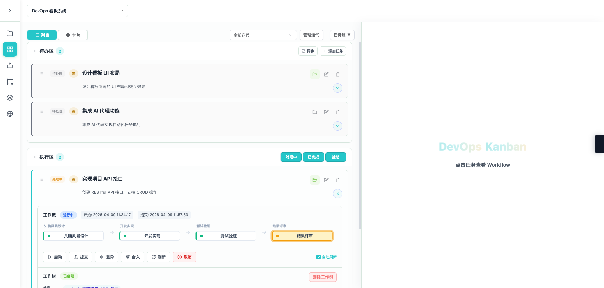
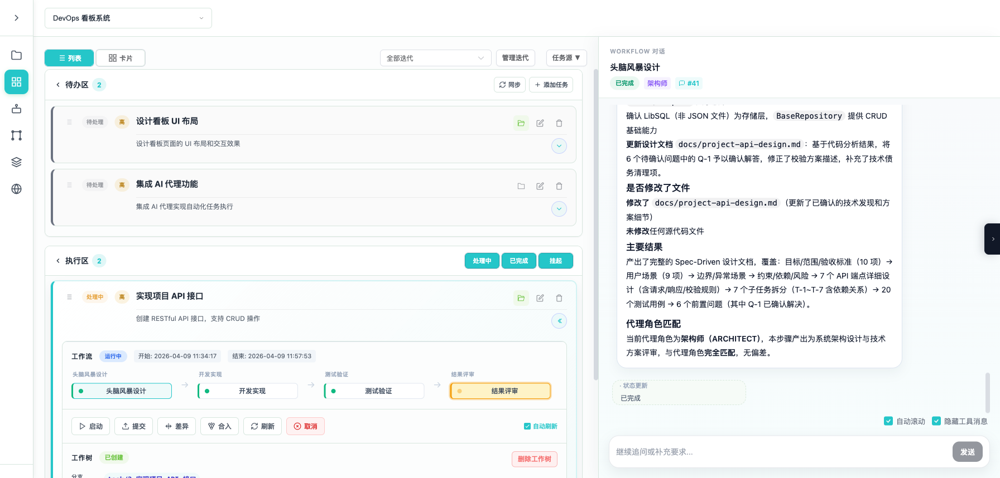
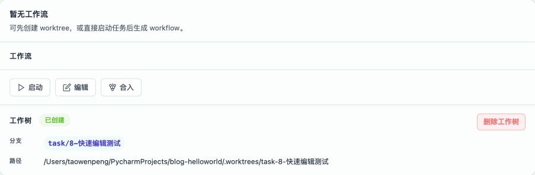
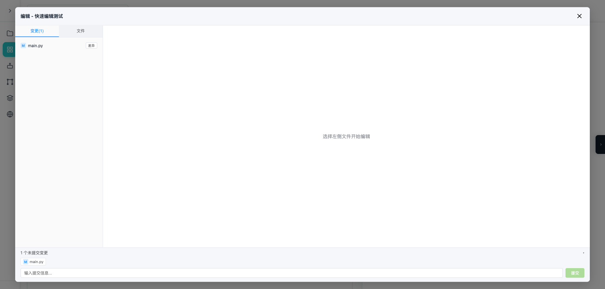
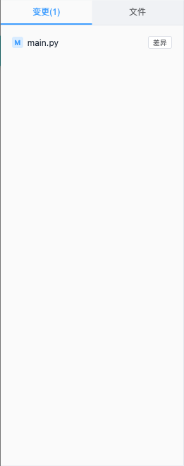
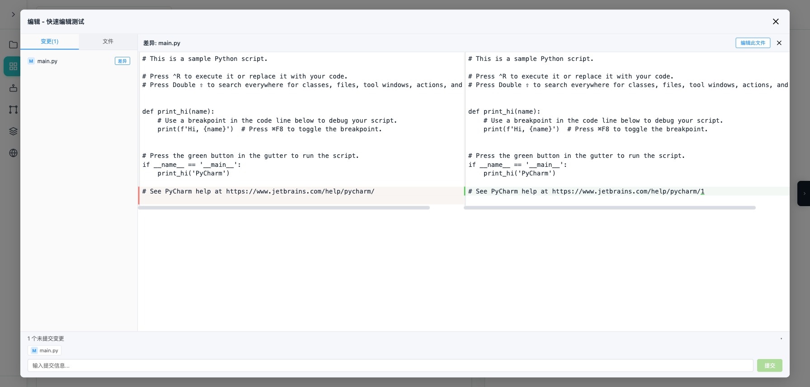
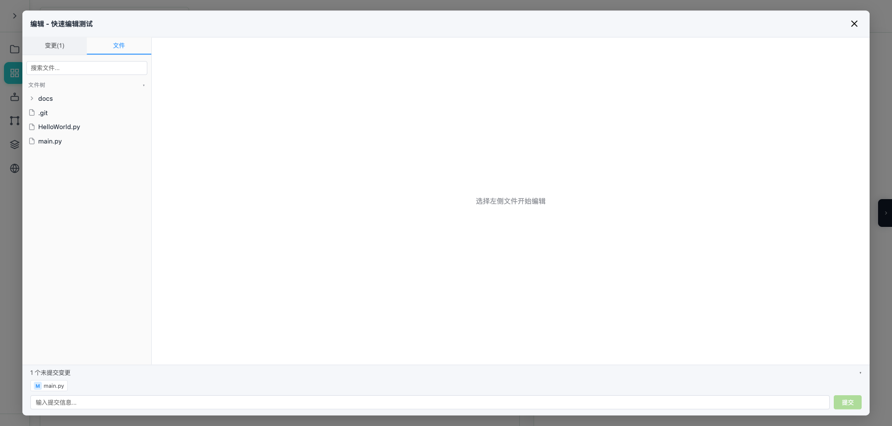
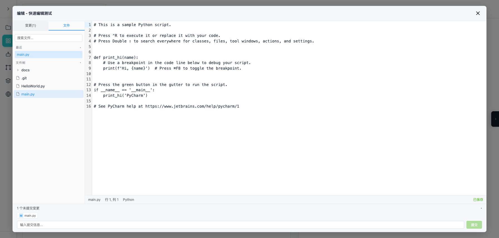

# Coplat 新手入门指南

## 目录

- [开始使用](#开始使用)
- [认识界面](#认识界面)
- [功能详解](#功能详解)
- [常见问题](#常见问题)

---

## 开始使用

### 第一步：启动系统

打开终端，进入项目目录，运行：

```bash
./start.sh
```

等待启动完成后，在浏览器打开：

- **主界面**: http://localhost:3000

### 第二步：停止系统

用完之后，在终端按 `Ctrl+C` 即可停止。

> **注意**: 首次启动可能需要 1-2 分钟安装依赖，请耐心等待。

---

## 认识界面

### 左侧导航栏

启动后你会看到左侧有一列图标，从上到下分别是：

| 图标 | 名称 | 用途 |
|------|------|------|
| 📁 | 项目列表 | 查看和管理所有项目 |
| 📋 | 看板 | 进入当前项目的任务管理界面 |
| 👥 | 我的团队 | 管理 AI 团队成员 |
| 🔄 | 工作流模板 | 配置任务的执行流程 |
| 📚 | 技能 | 管理团队的技能包 |
| 🌐 | MCP 服务器 | 配置外部服务连接 |

### 核心概念（简单理解）

**项目** — 你的工作空间，比如"前端改版"、"API 开发"等

**任务** — 项目中的具体工作，比如"设计登录页面"、"实现用户接口"

**Workflow（工作流）** — 任务执行的步骤流程，比如"设计→开发→测试→审查"

**Agent（AI 团队成员）** — 帮你干活的 AI 助手，每个成员有不同的专长

**迭代** — 工作周期，用来组织和筛选任务

---

## 功能详解

### 1. 项目管理


#### 你能做什么
- 查看所有项目
- 创建新项目
- 编辑或删除现有项目

#### 创建新项目

1. 点击左侧导航栏的 **项目列表** 图标（📁）
2. 点击右上角的 **「+ 新建项目」** 按钮
3. 在弹出的窗口中填写：
   - **项目名称**：给你的项目起个名字（必填）
   - **仓库路径**：输入本地 Git 仓库的路径
   - **描述**：简单说明这个项目做什么（可选）
4. 点击 **「保存」** 完成创建

#### 打开项目

在项目列表中，点击项目卡片上的 **「打开看板」** 按钮，即可进入该项目的任务管理界面。

---

### 2. 任务管理


#### 你能做什么
- 查看项目中的所有任务
- 创建新任务
- 编辑或删除任务
- 切换列表和卡片视图
- 按迭代筛选任务

#### 页面布局

打开看板后，你会看到：

- **顶部工具栏**：项目选择器、视图切换、迭代筛选
- **左侧任务区**：按状态分为"待办区"和"执行区"
- **右侧对话区**：查看任务执行详情（需要点击任务后显示）

#### 创建新任务

1. 在对应的区域（待办区或执行区）找到 **「+ 添加任务」** 按钮
2. 在弹出的窗口中填写：
   - **任务标题**：用一句话描述要做什么
   - **任务描述**：详细说明具体要求
   - **状态**：选择当前状态（待办/处理中/已完成/挂起）
   - **优先级**：选择重要程度（低/中/高/紧急）
   - **迭代**：关联到哪个工作周期（可选）
3. 点击 **「保存」**

#### 编辑任务

- 找到要编辑的任务卡片，点击右侧的 **编辑图标**（铅笔形状）
- 修改内容后点击保存

#### 删除任务

- 找到要删除的任务卡片，点击右侧的 **删除图标**（垃圾桶形状）
- 确认删除即可

---

### 3. 我的团队（AI 成员管理）


#### 你能做什么
- 查看团队中的所有 AI 成员
- 创建新的 AI 成员
- 编辑或删除成员
- 给成员分配技能和工具

#### 认识团队成员

点击左侧导航栏的 **我的团队** 图标（👥），你会看到：

- **左侧列表**：显示所有团队成员
- **右侧详情**：显示选中成员的详细信息

#### 创建新成员

1. 点击左上角的 **「+ 添加成员」** 按钮
2. 在弹出的窗口中填写：
   - **成员名称**：如"后端开发"、"前端开发"
   - **类型**：选择使用的 AI 工具（Claude Code / OpenCode）
   - **职位**：选择专长领域（后端/前端/全栈/测试/架构等）
   - **描述**：说明这个成员负责什么（可选）
   - **技能**：从下拉菜单选择要关联的技能
   - **MCP 服务器**：选择要关联的外部服务
3. 点击 **「保存」**

#### 职位说明

| 职位 | 适合做什么 |
|------|-----------|
| 后端开发 | API 接口、数据库、服务器端代码 |
| 前端开发 | 页面设计、用户界面、交互效果 |
| 全栈开发 | 前后端都能做 |
| 测试工程师 | 编写测试用例、自动化测试 |
| 架构师 | 系统设计、技术方案评审 |

#### 启用/禁用成员

在成员详情页面，找到 **「已启用」** 开关：
- 打开开关：成员可以参与任务执行
- 关闭开关：成员暂时休息，不参与工作

---

### 4. 工作流模板


#### 你能做什么
- 查看预设的工作流程
- 创建自定义工作流程
- 编辑或删除工作流程
- 调整工作步骤

#### 什么是工作流？

工作流就是一个任务的"执行计划"。比如开发一个功能，可以按照以下步骤：

```
1. 头脑风暴设计 → 2. 开发实现 → 3. 测试验证 → 4. 结果评审
```

每个步骤都由不同的 AI 成员来完成。

#### 使用预设模板

系统已经准备好了一些常用模板：

| 模板名称 | 适用场景 |
|----------|----------|
| 默认工作流 | 一般任务，4 个步骤 |
| 前端开发：通用功能交付 | 前端页面开发 |
| 研发交付：标准功能开发 | 完整的功能开发 |
| 研发交付：缺陷修复与防回归 | Bug 修复 |
| 查询天气 | 简单查询任务 |

直接选择一个模板使用即可。

#### 创建自定义模板

1. 点击左侧导航栏的 **工作流模板** 图标（🔄）
2. 点击左侧的 **「新建模板」** 按钮
3. 输入模板名称
4. 在右侧编辑步骤：
   - 点击 **「+」** 号添加新步骤
   - 点击步骤卡片进行编辑
   - 拖拽步骤可以调整顺序
5. 编辑每个步骤：
   - **步骤名称**：这一步做什么
   - **角色**：由哪个团队成员执行
   - **步骤提示词**：告诉 AI 具体怎么做
   - **需要确认**：勾选后，AI 完成这一步会停下来等你确认
6. 点击 **「保存」**

#### 删除步骤

在步骤卡片右上角点击删除图标，即可删除该步骤（至少保留 1 个步骤）。

---

### 5. 执行任务

#### 你能做什么
- 启动任务执行
- 实时查看执行进度
- 查看 AI 的对话过程
- 审查 AI 的工作成果
- 决定是否继续或修改

#### 启动任务执行

1. 在看板页面找到要执行的任务
2. 点击任务卡片展开详情
3. 找到 **「展开 Workflow」** 按钮并点击
4. 点击 **「启动」** 按钮
5. 选择要使用的工作流模板（系统会根据任务类型推荐一个）
6. 确认后，任务开始自动执行

#### 查看执行进度

任务启动后，展开 Workflow 区域，你会看到：



- **工作流状态**：显示"运行中"或"已完成"
- **步骤时间线**：如"头脑风暴设计 → 开发实现 → 测试验证 → 结果评审"
- **开始/结束时间**：记录执行时间
- **工作树信息**：显示 Git 分支名称和工作目录路径
- **操作按钮**：启动、提交、差异对比、合入、刷新、取消

#### 查看 AI 对话

点击步骤时间线中的某个步骤名称（如"头脑风暴设计"），右侧会打开对话面板：



在对话面板中你可以看到：

- **步骤信息**：步骤名称、执行状态、使用的 Agent
- **AI 思考过程**：AI 在分析问题时的思考内容
- **工具调用**：AI 使用的工具（如读取文件、写入代码等）
- **代码变更**：AI 实际修改了什么文件
- **对话时间戳**：每条消息的发送时间

#### 审查 AI 的工作

当某个步骤完成后（特别是勾选了"需要确认"的步骤）：

1. 点击对应的步骤查看执行详情
2. 在右侧对话面板查看 AI 的思考过程和具体操作
3. 做出决定：
   - **批准**：没问题，继续下一步
   - **打回**：有问题，给出修改意见让 AI 重新做

#### 任务完成后

任务全部完成后，你可以：

- **差异**：对比 AI 修改了哪些代码
- **提交**：将修改保存到本地仓库
- **合入**：将修改合并到主分支

---

### 9. 快速编辑



#### 你能做什么
- 跳过 AI Agent，直接在编辑器中修改代码
- 快速浏览和搜索项目文件
- 查看未提交的变更并预览差异
- 在编辑器内直接提交变更

#### 打开编辑器

1. 在看板页面找到要编辑的任务
2. 确保任务已经创建过 Worktree（工作树状态为「已创建」）
3. 点击任务卡片上的 **「编辑」** 按钮（铅笔图标）

> **注意**：如果「编辑」按钮是灰色不可点击的，说明该任务还没有创建 Worktree。请先点击「启动」按钮启动一次工作流，或手动创建 Worktree。

---

#### 编辑器布局



打开编辑器后，你会看到三个主要区域：

- **左侧面板**：变更列表和文件浏览
- **中间区域**：代码编辑器和差异对比
- **底部区域**：提交区，用于提交变更

---

#### 变更列表（默认显示）



编辑器打开时，默认左侧显示的是当前 Worktree 中所有**未提交的变更**。

每个文件前面的状态标记含义：
- **A**（绿色）= 新增文件
- **M**（蓝色）= 已修改文件
- **D**（红色）= 已删除文件
- **?**（灰色）= 未跟踪文件

**点击文件路径** → 在编辑器中打开该文件进行编辑
**点击「差异」按钮** → 查看该文件的左右对比差异

---

#### 查看文件差异



点击变更列表中任意文件后面的「差异」按钮，会打开左右对比视图：

- **左边**：HEAD 版本（提交前的原始内容，只读）
- **右边**：当前版本（修改后的内容，只读）
- 有差异的行会用颜色高亮标记

如果你想编辑某个有差异的文件，点击顶部的 **「编辑此文件」** 按钮即可跳转到编辑模式。

---

#### 浏览和搜索文件



点击左侧顶部的 **「文件」** 标签，切换到文件浏览模式：

1. **搜索文件**：顶部的搜索框可以按文件名搜索
2. **最近文件**：显示你最近打开过的文件，方便快速切换
3. **文件树**：点击「文件树」展开完整的项目目录结构

---

#### 编辑文件

在文件列表或变更列表中点击任意文件，即可在中间的代码编辑器中打开：

- 支持代码语法高亮（JavaScript、TypeScript、Python、HTML、CSS、JSON 等）
- 显示行号和光标位置
- 按 **Ctrl+S**（Mac 上为 **Cmd+S**）快速保存
- 未保存的变更会显示「保存」按钮

---

#### 提交变更



保存文件后，底部会自动展开提交区：

1. 提交区顶部显示所有未提交变更的列表
2. 在输入框中填写提交信息，如 `fix: 修复登录按钮样式`
3. 点击 **「提交」** 按钮（或直接按回车键）
4. 提交成功后，变更列表会自动刷新

如果你想稍后再提交，可以点击提交区右上角收起它，或者关闭编辑器下次再打开。

---

#### 关闭编辑器

- 点击右上角的 **✕** 按钮，或按 **Escape** 键关闭
- 如果有未保存的变更，会弹出确认提示
- 关闭编辑器不会影响已保存的变更和已提交的修改

---

#### 提交和合入

在编辑器中完成提交后，回到看板页面：

1. 点击任务卡片上的 **「合入」** 按钮
2. 将任务分支的变更合并到主分支

---

### 6. 技能管理


#### 你能做什么
- 查看已有的技能
- 创建新技能
- 上传或删除技能文件

#### 什么是技能？

技能就是一份"操作手册"，告诉 AI 成员如何完成特定工作。比如：

- "代码规范"技能：告诉 AI 遵循什么样的代码风格
- "测试规范"技能：告诉 AI 如何编写测试用例

#### 创建技能

1. 点击左侧导航栏的 **技能** 图标（📚）
2. 点击右上角的 **「+ 创建技能」** 按钮
3. 填写：
   - **名称**：技能的名称
   - **描述**：说明这个技能是做什么的
4. 上传技能文件（Markdown 格式）
5. 点击 **「保存」**

#### 关联技能到成员

1. 进入 **我的团队** 页面
2. 点击要编辑的成员
3. 在技能栏选择要关联的技能
4. 保存后，该成员执行任务时会自动加载这些技能

---

### 7. MCP 服务器


#### 你能做什么
- 配置外部服务连接
- 让 AI 成员使用外部工具

#### 什么是 MCP 服务器？

MCP 服务器就像是给 AI 成员配备的"外部工具"。比如：

- 天气服务器：让 AI 可以查询天气信息
- 数据库服务器：让 AI 可以连接数据库

#### 创建 MCP 服务器

1. 点击左侧导航栏的 **MCP 服务器** 图标（🌐）
2. 点击右上角的 **「+ 创建服务器」** 按钮
3. 填写：
   - **名称**：服务器的名称
   - **类型**：选择连接方式（Stdio / WebSocket）
   - **配置**：输入连接信息（如命令和参数）
4. 点击 **「保存」**

#### 关联服务器到成员

1. 进入 **我的团队** 页面
2. 点击要编辑的成员
3. 在 MCP 服务器栏选择要关联的服务器
4. 保存后，该成员就可以使用这个外部服务了

---

### 8. 迭代管理

#### 你能做什么
- 创建工作周期
- 按周期筛选任务
- 管理周期内的任务

#### 什么是迭代？

迭代就是一个工作周期，比如"第一周"、"冲刺 1"等。通过迭代可以把任务分组管理。

#### 创建迭代

1. 在看板页面顶部找到 **「管理迭代」** 按钮并点击
2. 点击 **「创建迭代」**
3. 填写：
   - **名称**：迭代的名称，如"第一周"
   - **开始日期**：周期开始时间
   - **结束日期**：周期结束时间
4. 点击 **「保存」**

#### 按迭代筛选任务

在看板页面顶部：

1. 找到 **迭代下拉框**
2. 选择要查看的迭代
3. 页面只显示该迭代的任务
4. 选择 **"全部迭代"** 可查看所有任务

---

## 常见问题

### 启动问题

#### 启动时提示端口被占用

**解决方法**：

直接在终端重新运行 `./start.sh`，系统会自动清理被占用的端口。

#### 启动很慢，卡在安装依赖

**原因**：首次启动需要下载依赖包，可能需要几分钟

**解决方法**：耐心等待，看到进度条走完即可。后续启动会快很多。

---

### 日志查看

如果遇到问题，可以查看日志文件找原因：

**前端日志位置**：
```
log/frontend/kanban-frontend-日期时间.log
```

**后端日志位置**：
```
log/backend/kanban-backend-日期时间.log
```

**查看最新日志**：
```bash
tail -f log/backend/kanban-backend-*.log
```

---

### 任务执行问题

#### 任务启动后没反应

**排查步骤**：

1. 查看后端日志是否有报错
2. 检查 AI 成员是否已启用
3. 确认工作流模板配置正确
4. 尝试重启系统

#### 任务执行失败

**排查步骤**：

1. 点击查看失败的任务
2. 找到失败的步骤
3. 查看错误信息
4. 根据错误提示修改配置后重试

#### 如何重新执行任务

1. 找到执行失败的任务
2. 点击 **「启动」** 按钮
3. 选择工作流模板
4. 系统会从失败的地方继续执行

---

### Git 相关问题

#### 无法创建 Worktree 沙箱

**可能原因**：

- 仓库路径填写错误
- Git 仓库未初始化
- 分支名称冲突

**解决方法**：

1. 确认项目配置中的仓库路径是否正确
2. 在终端运行 `git status` 检查仓库状态
3. 清理残留的 worktree：
   ```bash
   git worktree prune
   ```

---

### 其他问题

#### 页面显示空白

**解决方法**：

1. 刷新页面（按 F5 或 Cmd+R）
2. 检查浏览器控制台是否有报错
3. 确认后端服务是否正常运行

#### 数据丢失

**注意**：所有数据都存储在 `data/` 目录下，建议定期备份。

**备份方法**：
```bash
cp -r data data-backup-日期
```

---

## 快速上手流程

按照以下顺序，你可以在 10 分钟内跑通一个完整流程：

### 第 1 步：创建项目（1 分钟）

1. 打开 http://localhost:3000
2. 点击「+ 新建项目」
3. 填写名称和仓库路径，保存

### 第 2 步：创建任务（1 分钟）

1. 进入项目看板
2. 点击「+ 添加任务」
3. 填写任务标题和描述，保存

### 第 3 步：启动执行（2 分钟）

1. 点击任务卡片展开详情
2. 点击「启动」
3. 选择「默认工作流」
4. 等待 AI 开始执行

### 第 4 步：审查结果（2 分钟）

1. 查看每个步骤的执行情况
2. 确认 AI 的工作是否符合要求
3. 决定批准或打回修改

### 第 5 步：合并代码（1 分钟）

1. 点击「查看变更」确认修改内容
2. 点击「提交」保存修改
3. 点击「合并」将修改合并到主分支

---

## 快速编辑流程（无需 AI Agent）

如果你想快速修改一行代码，跳过完整 AI 工作流：

### 第 1 步：打开编辑器（30 秒）

1. 在看板页面找到目标任务
2. 点击任务卡片上的 **「编辑」** 按钮

### 第 2 步：修改代码（1 分钟）

1. 在左侧「变更」列表中点击要修改的文件
2. 在中间编辑器中修改代码
3. 按 **Ctrl+S**（或 Cmd+S）保存

### 第 3 步：提交变更（30 秒）

1. 底部提交区自动展开
2. 填写提交信息，如 `fix: 修复按钮颜色`
3. 点击「提交」或按回车

### 第 4 步：合入主分支（30 秒）

1. 关闭编辑器
2. 点击任务卡片上的 **「合入」** 按钮

---

## 小贴士

1. **首次使用建议**：先熟悉界面，再尝试创建一个小任务跑通流程
2. **定期保存**：编辑任务或模板时记得点击保存
3. **备份数据**：重要数据建议定期备份 `data/` 目录
4. **遇到问题**：先查看日志文件，大部分问题都能从日志中找到线索
