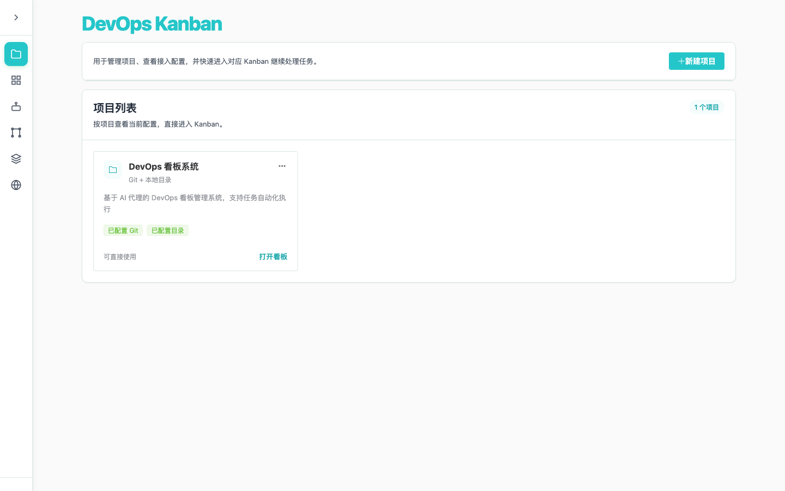
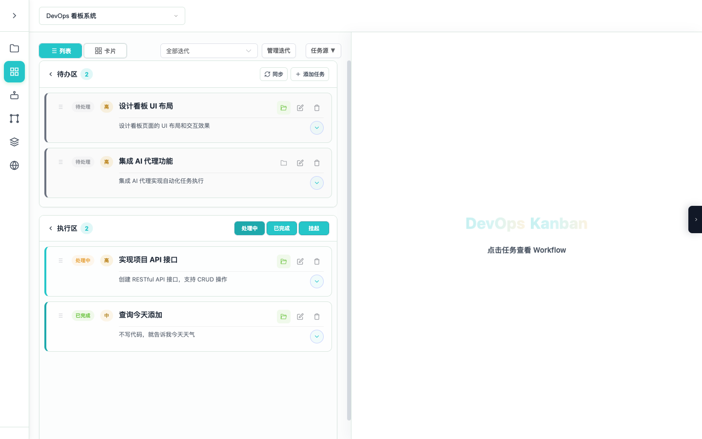
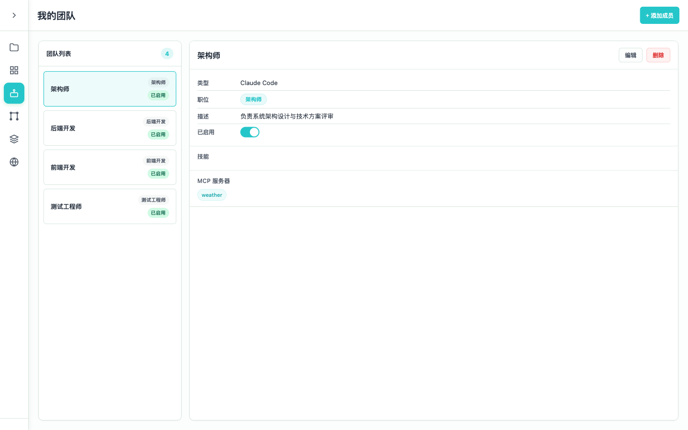
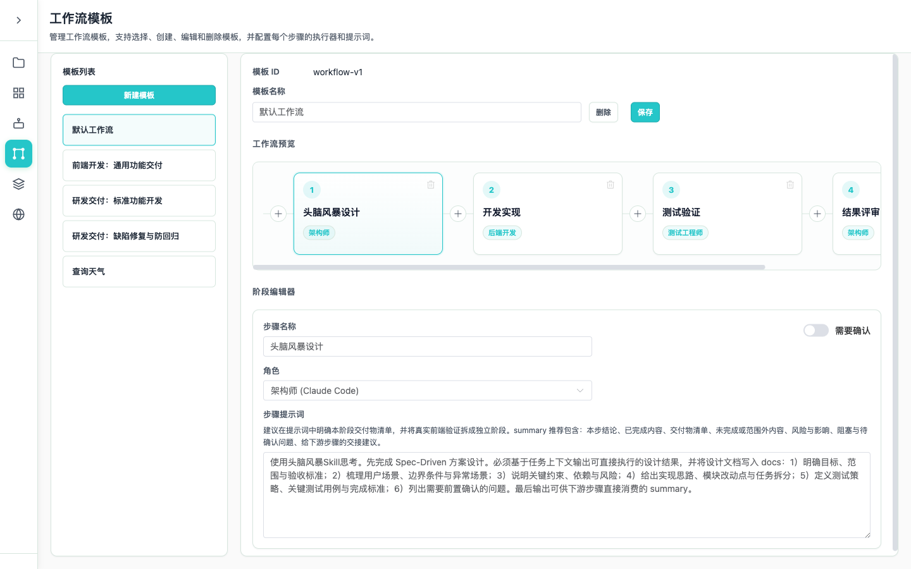
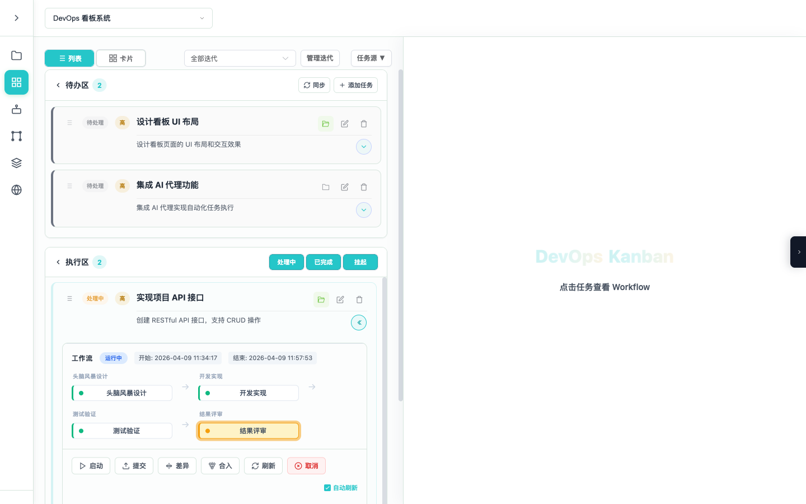
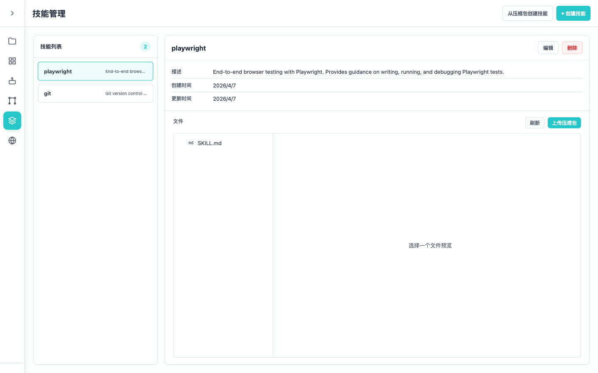
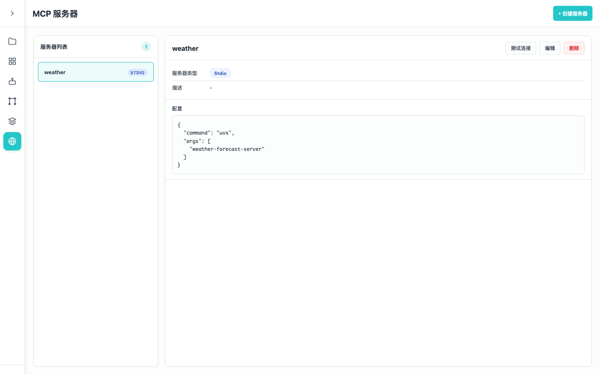

# DevOps Kanban 使用指南

## 目录

- [快速开始](#快速开始)
- [核心概念](#核心概念)
- [功能使用详解](#功能使用详解)
- [常见问题排查](#常见问题排查)
- [高级配置](#高级配置)

---

## 快速开始

### 环境要求

- **Node.js**: 22.x 版本（要求 `>=22 <23`）
- **Git**: 用于 Worktree 隔离

### 一键启动

**macOS / Linux：**
```bash
./start.sh
```

**Windows：**
```cmd
start.bat
```

启动后访问：
- **前端界面**: http://localhost:3000
- **后端 API**: http://localhost:8000
- **API 文档**: http://localhost:8000/docs

### 手动启动

**后端（Node.js Fastify）：**
```bash
cd backend
npm install
npm run dev          # 开发服务器（端口 8000）
npm run build        # TypeScript 编译
npm test             # 运行测试
```

**前端（Vue 3）：**
```bash
cd frontend
npm install
npm run dev          # 开发服务器（端口 3000）
npm run build        # 生产构建
npm run test:run     # 运行测试（单次）
```

### 停止服务

按 `Ctrl+C` 可优雅停止所有服务。

---

## 核心概念

### Harness Engineering 五原则

| 原则 | 含义 | 实现方式 |
|------|------|----------|
| **隔离性 Isolation** | 每个 Agent 任务在独立环境中运行 | Git Worktree —— 每个任务创建独立工作目录和分支 |
| **可观测性 Observability** | Agent 执行过程实时可见 | Session/Event + WebSocket 实时推送 |
| **可恢复性 Recovery** | 失败后能从断点继续 | Session Segment + Retry Chain |
| **可控性 Control** | 人在关键节点可以介入 | Workflow Suspend/Resume |
| **可追溯性 Traceability** | 每次执行有完整记录 | Template Snapshot + Event Audit Trail |

### 数据模型层级

```
项目 (Project)
  └── 迭代 (Iteration)
       └── 任务 (Task)
            └── Workflow 运行 (WorkflowRun)
                 └── 步骤 (Step)
                      └── 会话 (Session)
                           └── 事件 (Event)
```

### 任务状态流转

```
TODO → IN_PROGRESS → DONE
         │
         ├──→ BLOCKED
         ├──→ CANCELLED
         └──→ REQUIREMENTS

优先级：LOW → MEDIUM → HIGH → CRITICAL
```

---

## 功能使用详解

### 1. 项目管理

#### 项目首页



#### 创建项目

1. 访问首页 http://localhost:3000
2. 点击「新建项目」按钮
3. 填写项目信息：
   - **项目名称**：必填
   - **仓库路径**：本地 Git 仓库路径或远程仓库 URL
   - **描述**：可选

#### 编辑/删除项目

- 在项目卡片上点击编辑图标可修改项目信息
- 点击删除图标可删除项目（会同时删除关联的需求和任务）

---

### 2. 需求与任务管理

#### 项目看板



#### 创建需求

1. 进入项目看板页面
2. 在「需求」列点击「+ 新建需求」
3. 填写需求标题、描述、优先级

#### 创建任务

1. 在看板页面点击任意任务列的「+」按钮
2. 填写任务信息：
   - **标题**：简明描述任务内容
   - **描述**：详细说明任务要求
   - **状态**：TODO / IN_PROGRESS / DONE / BLOCKED
   - **优先级**：LOW / MEDIUM / HIGH / CRITICAL
   - **迭代**：关联到特定迭代周期

#### 任务看板操作

- **拖拽**：可在不同状态列之间拖动任务卡片
- **视图切换**：支持看板视图和列表视图
- **迭代筛选**：可按迭代周期过滤任务

---

### 3. 任务源同步（外部系统集成）

#### 配置任务源

1. 在看板页面点击「任务源」按钮展开面板
2. 点击「添加任务源」
3. 选择任务源类型：
   - **GitHub Issues**：从 GitHub 仓库导入 Issue
   - **CloudDevOps RR**：从企业内部 DevOps 平台导入需求

#### GitHub Issues 配置

```json
{
  "type": "GITHUB",
  "config": {
    "repository": "owner/repo",
    "token": "ghp_xxx",
    "state": "open",
    "labels": []
  }
}
```

#### CloudDevOps RR 配置

```json
{
  "type": "CLOUD_DEVOPS_RR",
  "config": {
    "baseUrl": "https://devops.example.com",
    "token": "xxx",
    "projectKey": "PROJ",
    "listPath": "/api/rr/list",
    "detailPath": "/api/rr/detail"
  }
}
```

#### 同步任务

1. 配置完成后点击「预览」
2. 选择要导入的任务（已导入的任务会显示标记）
3. 点击「确认导入」

---

### 4. Agent 配置

#### Agent 配置页面



#### 创建 Agent

1. 进入「Agent 配置」页面
2. 点击「创建 Agent」
3. 填写配置：
   - **名称**：如 "Backend Dev"
   - **类型**：CLAUDE_CODE / OPEN_CODE
   - **角色**：BACKEND_DEV / FRONTEND_DEV / FULLSTACK / DEVOPS 等
   - **技能**：可关联预定义的技能
   - **MCP 服务器**：可关联 MCP 服务配置

#### 内置角色类型

| 角色 Key | 中文名 | 说明 |
|----------|--------|------|
| BACKEND_DEV | 后端开发 | 专注于 API、数据库、服务端开发 |
| FRONTEND_DEV | 前端开发 | 专注于 UI、交互、前端架构 |
| FULLSTACK | 全栈开发 | 前后端均可处理 |
| DEVOPS | 运维工程 | CI/CD、部署、监控 |
| QA_ENGINEER | 质量工程 | 测试设计、自动化测试 |
| SECURITY | 安全工程 | 安全审计、漏洞修复 |
| ARCHITECT | 架构师 | 系统设计、技术方案 |

---

### 5. Workflow 模板配置

#### Workflow 模板配置页面



#### 创建 Workflow 模板

1. 进入「Workflow 模板配置」页面
2. 点击「创建模板」
3. 填写模板名称
4. 配置步骤：

#### 添加步骤

1. 在流程预览中点击「+」按钮添加步骤
2. 配置步骤详情：
   - **步骤名称**：如 "方案设计"
   - **执行 Agent**：选择负责该步骤的 Agent
   - **执行提示词**：告诉 Agent 这一步该做什么
   - **需要确认**：勾选后步骤完成时会暂停等待人工审查

#### 内置模板

| 模板 | 步骤数 | 工程方法 |
|------|--------|----------|
| **Default Workflow** | 4 | 设计 → 实现 → 验证 → 审查 |
| **SDD+TDD 标准开发** | 7 | 软件设计文档 → 测试驱动开发 |
| **前端交付** | 7 | 场景定义 → UI 设计 → 页面实现 → 视觉验证 |
| **Bug 修复** | 7 | 根因分析 → 修复 → 回归测试 |

#### 拖拽排序

- 可直接拖拽步骤调整顺序
- 拖拽模板卡片调整模板优先级

---

### 6. 执行 Workflow

#### Workflow 执行中



#### 启动任务

1. 在看板中点击任务卡片
2. 点击「启动 Workflow」
3. 选择 Workflow 模板（系统会根据任务类型推荐）
4. 确认后开始执行

#### 执行过程观察

1. 点击正在执行的任务
2. 右侧面板显示实时会话：
   - Agent 思考过程
   - 工具调用记录
   - 代码变更内容
   - 会话时间线

#### 人工介入

当步骤配置了「需要确认」时：
1. Workflow 会在步骤完成后自动暂停
2. 审查 Agent 的输出和修改
3. 可选择：
   - **批准**：继续执行下一步
   - **打回**：提供反馈，要求重新执行该步骤

#### 查看执行历史

1. 点击已完成的任务
2. 点击 Workflow 时间线中的任意节点
3. 查看该步骤的详细执行记录

---

### 7. 代码变更审查

#### 查看 Worktree Diff

1. 任务执行完成后，点击「查看变更」
2. 系统展示 Worktree 与主分支的差异
3. 逐文件查看代码变更

#### 提交变更

1. 确认变更无误后点击「提交」
2. 填写 Commit 信息
3. 提交到 Worktree 分支

#### 合并到主分支

1. 点击「合并」按钮
2. 选择目标分支（通常为 main/master）
3. 处理可能的合并冲突

---

### 8. 迭代管理

#### 创建迭代

1. 在看板页面点击「管理迭代」
2. 点击「创建迭代」
3. 填写迭代名称、开始/结束日期

#### 迭代任务筛选

- 使用迭代下拉框筛选特定周期的任务
- 可清空筛选查看所有任务

---

### 9. 技能管理

#### 技能管理页面



#### 创建技能

1. 进入「技能配置」页面
2. 点击「创建技能」
3. 填写技能信息：
   - **名称**：如 "TypeScript 规范"
   - **标识符**：用于代码引用
   - **描述**：技能用途说明
   - **内容**：技能文件内容

#### 关联技能到 Agent

在 Agent 配置中勾选要关联的技能，执行 Workflow 时会自动同步到 Worktree。

---

### 10. MCP 服务器配置

#### MCP 服务器配置页面



#### 添加 MCP 服务器

1. 进入「MCP 服务器配置」页面
2. 点击「添加服务器」
3. 填写配置：
   - **名称**：如 "GitHub MCP"
   - **类型**：stdio / websocket
   - **命令**：启动命令
   - **参数**：命令行参数
   - **环境变量**：可选

#### 关联 MCP 到 Agent

在 Agent 配置中勾选要使用的 MCP 服务器。

---

## 常见问题排查

### 启动问题

#### 端口被占用

**现象**：启动时提示端口 3000 或 8000 已被占用

**解决**：
```bash
# 查看占用端口的进程
lsof -ti :3000
lsof -ti :8000

# 杀死占用端口的进程
kill -9 $(lsof -ti :3000)
kill -9 $(lsof -ti :8000)
```

或直接运行 `./start.sh`，脚本会自动清理端口。

#### Node.js 版本不兼容

**现象**：启动时提示需要 Node.js 22+

**解决**：
```bash
# 使用 nvm 切换版本
nvm install 22
nvm use 22

# 或使用 n
n 22
```

---

### 日志查看

#### 前端日志

**位置**：`log/frontend/kanban-frontend-YYYYMMDD-HHMMSS.log`

**实时查看**：
```bash
tail -f log/frontend/kanban-frontend-*.log
```

#### 后端日志

**位置**：`log/backend/kanban-backend-YYYYMMDD-HHMMSS.log`

**实时查看**：
```bash
tail -f log/backend/kanban-backend-*.log
```

#### 结构化日志格式

```
2026-04-09T10:30:00.000Z [INFO] [WorkflowService] Starting workflow execution { workflowId: "wf-123", taskId: "task-456" }
```

日志级别：DEBUG < INFO < WARN < ERROR

---

### Workflow 执行问题

#### Step 执行失败

**排查步骤**：
1. 查看 Workflow 时间线，定位失败的步骤
2. 点击步骤查看 Session 事件
3. 检查 `error` 类型事件的详细信息
4. 查看后端日志中的错误堆栈

**常见原因**：
- Agent 配置错误（未启用或类型不匹配）
- MCP 服务器连接失败
- Git Worktree 创建失败

#### Workflow 卡住不动

**排查步骤**：
1. 检查后端日志是否有异常
2. 查看 Mastra 数据库状态：`data/mastra.db`
3. 尝试重启后端服务

---

### Git Worktree 问题

#### Worktree 创建失败

**可能原因**：
- 仓库路径配置错误
- 分支名称冲突
- Git 配置问题

**解决**：
```bash
# 清理残留的 worktree
git worktree prune

# 查看现有 worktree
git worktree list

# 手动移除有问题的 worktree
git worktree remove .worktrees/task-xxx --force
```

#### 合并冲突

**解决**：
1. 在 Merge 对话框中查看冲突文件列表
2. 手动解决冲突后重新提交
3. 或放弃合并，重新执行 Workflow

---

### 数据问题

#### JSON 文件损坏

**恢复**：
```bash
# 备份当前数据
cp data/projects.json data/projects.json.bak

# 手动修复 JSON 格式
node -e "JSON.parse(require('fs').readFileSync('data/projects.json'))"
```

#### Workflow 状态不一致

**重置**：
```bash
# 删除 mastra.db（会丢失 Workflow 运行状态）
rm data/mastra.db

# 重启后端服务
```

---

## 高级配置

### 环境变量配置

编辑 `backend/.env`：

```bash
# 服务器配置
SERVER_HOST=0.0.0.0
SERVER_PORT=8000

# 数据存储路径
STORAGE_PATH=../data

# CORS 配置
CORS_ORIGINS=http://localhost:3000,http://localhost:5173

# 日志配置
LOG_LEVEL=info
LOG_DIR=./logs
LOG_FILE_MAX_SIZE=10m
LOG_FILE_KEEP=5
```

### 添加新的 Agent 执行器

```bash
curl -X POST http://localhost:8000/api/agents \
  -H "Content-Type: application/json" \
  -d '{
    "name": "Custom Agent",
    "type": "CUSTOM",
    "command": "custom-agent",
    "config": {}
  }'
```

### API 参考

所有接口统一返回格式：
```json
{
  "success": true,
  "message": "操作成功",
  "data": {},
  "error": null
}
```

| 资源 | 关键接口 |
|------|----------|
| Projects | `GET/POST/PUT/DELETE /api/projects` |
| Requirements | `GET/POST/PUT/DELETE /api/requirements` |
| Tasks | `GET/POST/PUT/DELETE /api/tasks`、`PATCH /api/tasks/{id}/status` |
| Sessions | `GET/POST/DELETE /api/sessions` |
| Task Sources | `GET/POST/PUT/DELETE /api/task-sources` |
| Agents | `GET/POST/PUT/DELETE /api/agents` |
| Workflow Templates | `GET/POST/PUT/DELETE /api/workflow-templates` |
| Health | `GET /health` |

详细 API 文档访问：http://localhost:8000/docs

---

## 典型使用流程

### 完整交付流程

```
1. 创建项目 → 关联 Git 仓库
2. 配置 Agent → 分配角色和技能
3. 同步任务源 → 从 GitHub/DevOps 平台导入任务
4. 创建迭代 → 规划交付周期
5. 启动 Workflow → 选择模板开始执行
6. 实时观察 → WebSocket 查看执行过程
7. 人工审查 → 在确认节点审查结果
8. 代码合并 → 审查变更并合并到主分支
```

### Harness Loop 示意

```
┌─────────────────────────────────────────────────────────┐
│                    Harness Loop                          │
│                                                          │
│  任务建模 → 选择 Workflow → 模板执行                     │
│                          ↓                               │
│              ┌─────────────────────┐                    │
│              │   Workflow Engine    │                    │
│              │ Step1 → Step2 → ...  │                    │
│              │   │       │          │                    │
│              │ Worktree  Suspend?   │                    │
│              └─────────────────────┘                    │
│                          ↓                               │
│         人工反馈 ←─── 暂停等待确认                       │
│              ↓                                           │
│         继续执行                                         │
│              ↓                                           │
│         审查合并                                         │
└─────────────────────────────────────────────────────────┘
```

---

## 技术支持

- **GitHub Issues**: 提交 Bug 报告和功能建议
- **API 文档**: http://localhost:8000/docs
- **日志目录**: `log/` 目录下按日期存储
